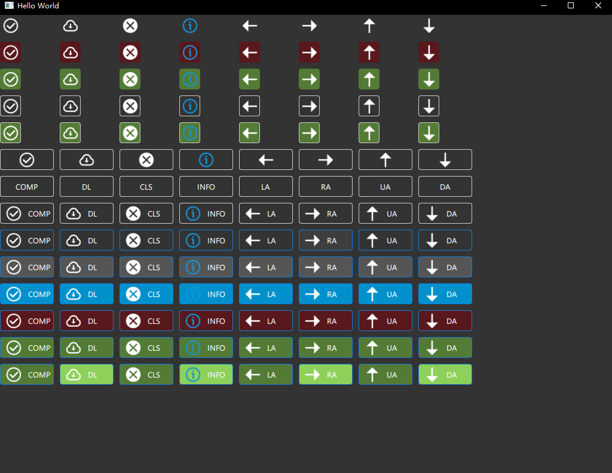
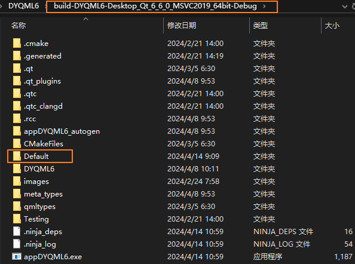

# DYQML6 Introduction

[Press for Chinese document](https://github.com/kongkongthu/DYQML6/blob/master/README_CH.md)

## I. Introduction

The name DYQML is an acronym for Dynamic QML. By loading a pre-written configuration file（a JSON format file）, the program can dynamically generate the corresponding front-end interface, as well as most of the business logic. Through this project, developers can quickly build their own QML front-end applications after mastering the configuration method.

In practice, this project is very friendly to projects with uncertain initial requirements that require constant modifications to the interface and business needs for three reasons: 1. Modifying requirements does not require changing the source code, ensuring the source code remains clean and tidy; 2. The configuration file is a distillation of control properties and business logic, making modifications more targeted, allowing for extremely fast modifications to the interface and functionality, with efficiency improvements by one to two orders of magnitude. With the help of professional JSON maintenance software, even faster modifications can be achieved; 3. If the components included in this project do not meet the business needs, it is only necessary to develop the corresponding controls and add them to the DYQML control ecosystem, which is a perfect implementation of the open-closed principle, avoiding the need for extensive modifications to the source code.

At the same time, this project is very friendly to industrial and engineering projects that involve a large amount of real-time data. The display control elements on the interface are triggered by a unified clock and obtain data from the C++ backend through a unified mechanism, refreshing the interface display. Some engineering projects are very suitable for development with this project, as the data for these projects may come directly from data acquisition devices, networks, or acquisition cards, with data arriving continuously in real-time. DYQML can achieve real-time display of data while maintaining the speed and stability of C++ projects, with lower system resource requirements.

In addition, DYQML has further separated the interface from the C++ backend on the basis of Qt and Qt QML, allowing the interface to be its own entity and the backend to be its own also, and has standardized the signal transmission method between interface controls, between the interface and C++ backend, through a unified signal system, avoiding the chaos of signals and slot functions within the system as the project becomes more complex.

If your project has the above characteristics or requirements and you wish to use the features of QML without good understanding QML, we strongly recommend you to employ DYQML for development. It can exponentially reduce the difficulty of maintaining your project and, as your understanding of DYQML deepens, you can add more complex customized functions.

DYQML6 is a project developed based on Qt6 (currently V6.6.0, which should be compatible with higher versions of Qt6). Due to some incompatibilities between Qt6 and Qt5 in certain cases, DYQML6 cannot be used with Qt5, as this would lead to some problems. In the future, depending on the actual needs of the project, a decision will be made on whether to release a version of DYQML5 that supports Qt5.

## II. Get started quickly

Follow the steps below to quickly get started with this project.

### Step 1: Install Qt6.6.0 or later version

If not installed, please download the official Qt installer and install it, if already installed you can skip it.

### Step 2: Clone this project to local

```bash
cd your-local-path
git clone https://wwww.github.com/kongkongthu/DYQML6.git
```

### Step 3: Run the project

Use Qt Creator to open the project file CMakeLists.txt, MSVC2019 compiler is recommended, of course, you can also use other versions of the compiler. Set it up and run it. if it runs successfully, you should see the main window below. Proceed to this step, it shows that the program has been successfully run, the following will be simple.


### 步骤4：加载配置文件

### Step 4: Loading Configuration Files

There are already some configuration files in this project, we can load them dynamically and display them. The pre-configured demo files are in the `configFiles/` path, and the files are in JSON format. In order to display the required images on the interface properly, it is recommended to copy the `images` folder in the project directory to the runtime directory first, otherwise the images or icons required by the demo will definitely not be displayed.

After copying the images folder, as shown in the figure above, use shortcut keys “Ctrl + O” to open the Select Configuration File dialog box, and then select a configuration file in `configFiles/`, such as **`Demo- SowingInterface-EN.json`**, the interface will dynamically load the required components and become as shown below:


Of course, we can also re-choose other configuration files, such as selecting **`Demo-CarScreenSoftware-EN.json`**, the interface will be dynamically displayed as follows:


The design of the above two interface demos are from the material on the Internet, I just use this project and configuration files to build their interfaces again.

There are some other demos in the `configFiles` directory, they are all centralized demos of a certain control, for example, the interface of **`Ctrl-Demo-Text-DefaultFontColor-EN.json`** is shown below.


The interface of loading **`Ctrl-Demo-Button-EN.json`** file:



We can try these demos one by one, so we won't list them here.

### 步骤5：默认加载

### Step 5: Loading by default

Selecting a configuration file every time by using the shortcut Ctrl+O would be cumbersome and would not be in line with the usage of most applications. We can create a new folder named `Default` in the program running directory, and copy a configuration file that need to be loaded by default to this folder (you can also copy the Default folder in the project directory to your program's runtime directory), so that every time the program starts, it will scan the folder for configuration files, and if there are any, the program will load it automatically.



Default loading will make debugging a lot easier, and we can also use this directory as the main directory for modifying configuration files. Modify the configuration file within the Default directory, and then use the shortcut Ctrl+R to reload it, allowing for a seamless cycle of configuration file modification, loading, and previewing.

When you know the project well enough, you can customize how to load the configuration files in the way you want, without the limitations of the above approach. For simple projects, the above approach is basically enough.

In addition, DYQML will dynamically destroy the previously created interface and all controls on the interface when re-loading the configuration file, so we don't need to be concerned about the increase in memory and CPU usage caused by multiple loads.

## III. Advanced Features and Development

### 1. Configure your own configuration file

Now, developers reading to this part most concerned may be how to configure your own configuration files. Through a simple study, we can begin to configure, see the article: [Easy to get started with configuration files](https://github.com/kongkongthu/DYQML6/blob/master/docs/1-Easy%20to%20get%20started%20with%20configuration%20files.md).

If you want to customize your development or develop more advanced features, it is highly recommended to master the following.

### 2. Control System Composition

This project builds the interface by loading configuration files and dynamically loading predefined components. Understanding the component system allows you to customize and develop your own controls and implement dynamic loading of them. For details, please refer to the article:[Control System Composition and Customize Controls](https://github.com/kongkongthu/DYQML6/blob/master/docs/2-Control%20System%20Composition%20and%20Customize%20Controls.md)

### 3. Signal system composition

This project standardizes signals between C++ and QML, and between individual controls of QML, and the whole system is managed through a unified signal system. Under the premise of following the overall concept and structure of the signaling system for this project, any desired signaling and response can be achieved. For details, please refer to the article:[Signal System Composition](https://github.com/kongkongthu/DYQML6/blob/master/docs/3-Signal%20system%20composition.md)

### 4. Real-time data display and unified timer

This system is friendly to the display of real-time data and uses a unified timer which is `freshTimer`, to get the data and refresh the interface display. It is recommended that all the data that needs to be refreshed in real time should use this unified timer to refresh the data display. For details, please refer to the article: [Real-time Data and Unified Timer](https://github.com/kongkongthu/DYQML6/blob/master/docs/4-Real-time%20Data%20and%20Unified%20Timer.md).

### 5. Color Space Setting

This project supports the setting of color space, the control in the configuration JSON file will take the corresponding color value in the color space if it is not specified in the file. In addition to the default color space, we can also modify the color space through the configuration file, the color space of the system is designed to be very flexible, the details of the color and color space in the article: [Color and Color Space](https://github.com/kongkongthu/DYQML6/blob/master/docs/5-Color%20and%20Color%20Spaces.md)

### 6. Shortcut Keys and Interface Tips

This project supports the configuration of shortcut keys and interface tips. Except for a few shortcuts written by the system, other shortcuts and combinations of shortcuts can be configured directly through the configuration file. The interface tip information is the information that will pop up automatically when the mouse moves to a control, which is realized by using the QML ToolTip component. However, in order to maximize the use of resources, all tips are dynamically generated and dynamically destroyed. For details, see the article: [Shortcuts and tip message configuration](https://github.com/kongkongthu/DYQML6/blob/master/docs/6-Shortcuts%20and%20tip%20message%20configuration.md)

### 7. Customizing configuration file loading

There are projects where we don't need to load configuration files by default when the program runs, and we can't select the desired configuration file via the file selection dialog. For example, if we are developing a car management system, we may need to select the corresponding car model on the interface, and then load the corresponding car model interface with the corresponding configuration file. At this point we need to customize the loading of configuration files, see the article for details:[Customize the loading of configuration files](https://github.com/kongkongthu/DYQML6/blob/master/docs/7-Customize%20the%20loading%20of%20configuration%20files.md)

## IV. Future Plans

The future maintenance and development of this project will mainly focus on the following aspects:

1. Enhance and increase configurable basic capabilities: This is mainly reflected in two aspects. One is to increase and enhance the configuration functions supported on a macro level. The other is to increase and enhance the configurable properties of controls on a micro level.
2. Develop more configurable controls, in addition to adding basic controls, develop more general controls or industry-specific controls according to project requirements, while ensuring that the project structure remains simple and clear.
3. Identify bugs, resolve bugs, improve system stability, and enhance system performance.
4. Manage and maintain updates submitted by other developers.


