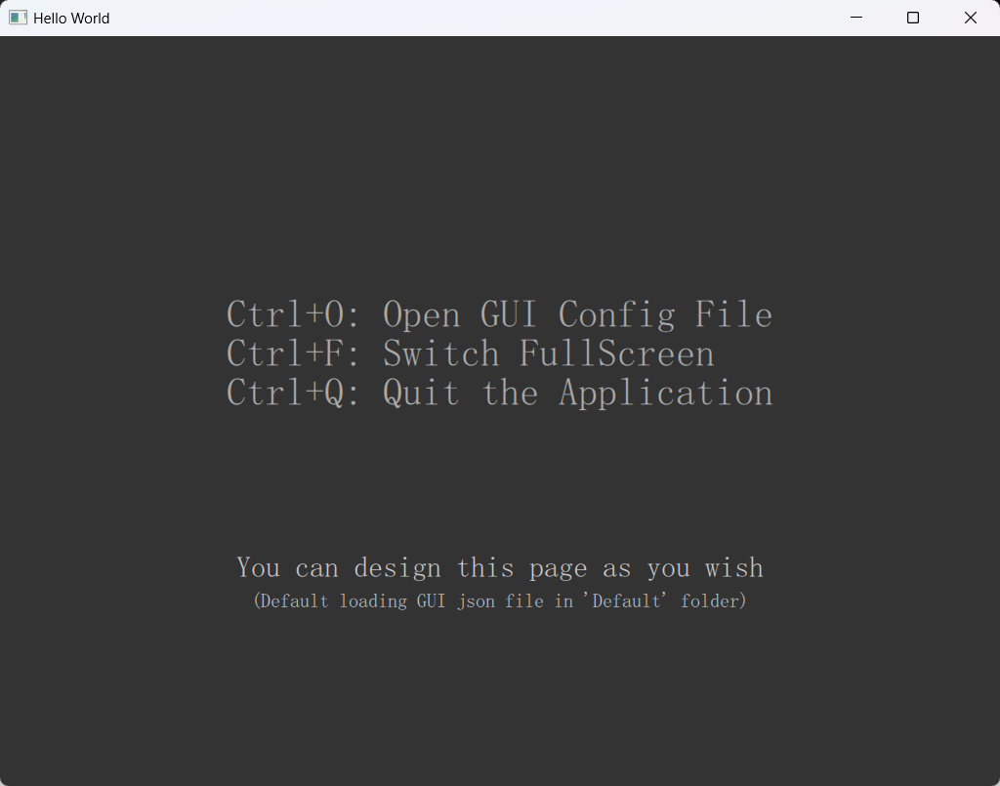
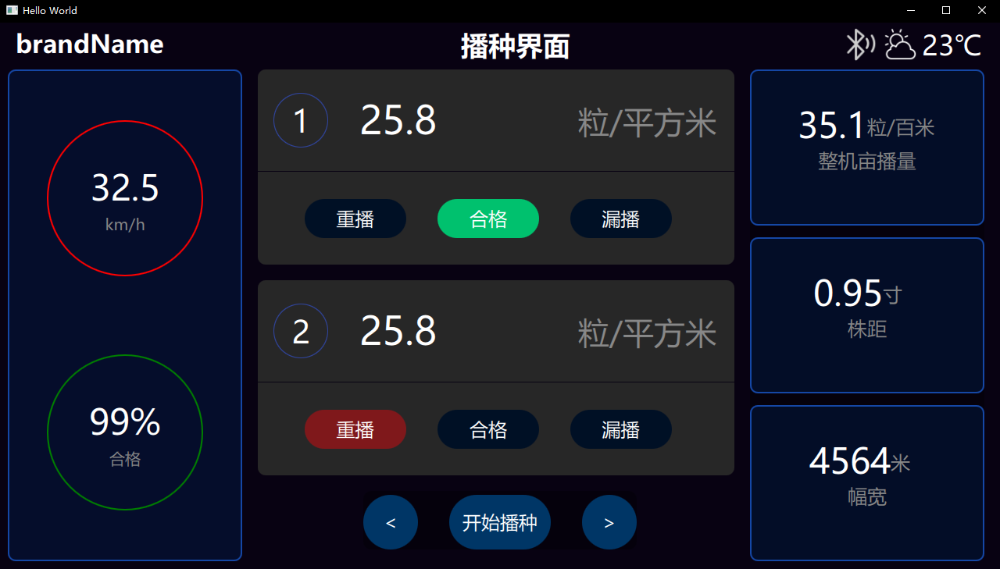
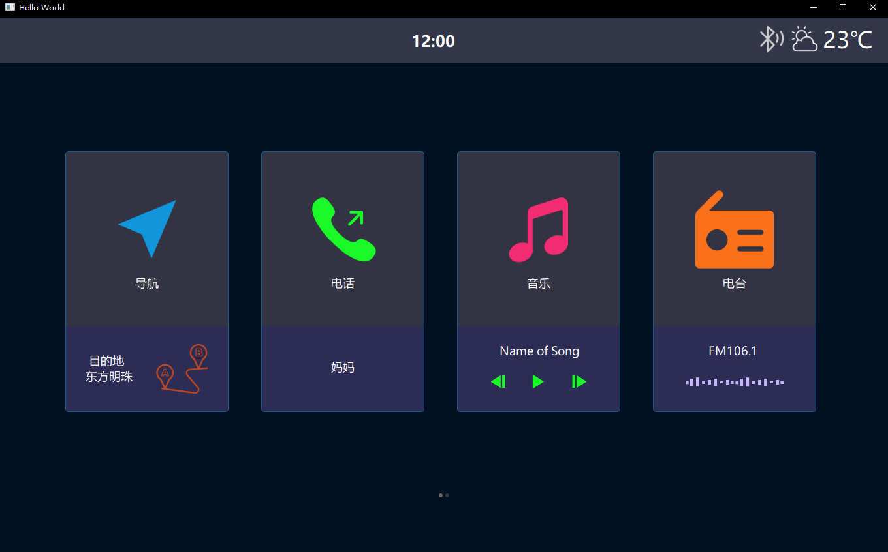
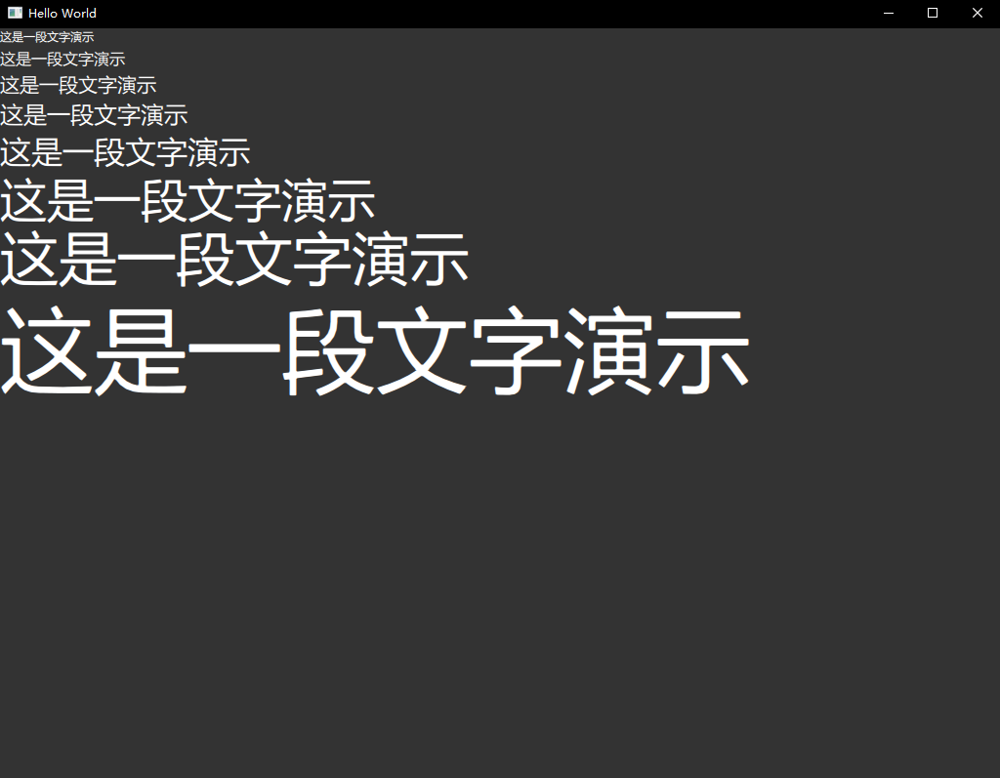
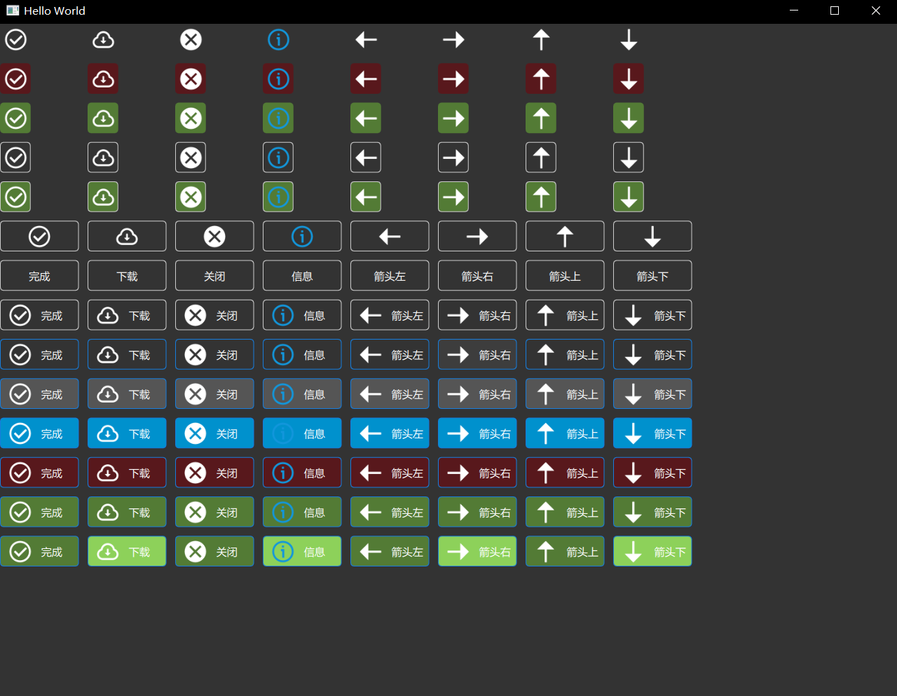
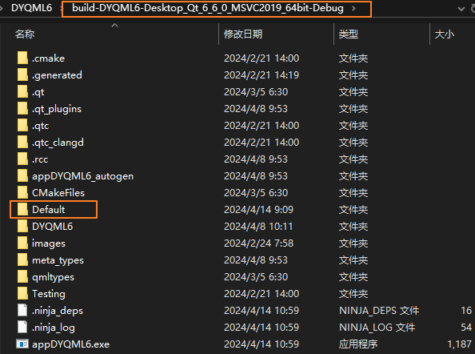
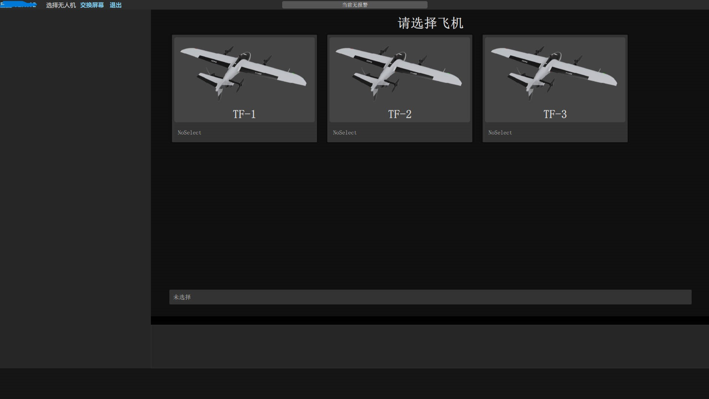

# DYQML6项目介绍

[点击转英文文档](https://github.com/kongkongthu/DYQML6/blob/master/README.md)

[TOC]

## 一、简介

DYQML这个名字是Dynamic QML的缩写，通过加载写好的配置文件(json格式文件)，程序可以动态生成对应的前端界面，同时也可以动态生成绝大多数业务逻辑。通过本项目，开发者在掌握了配置方法后，可以快速搭建自己的QML前端程序。

通过实践，本项目对于前期需求不定，需要不断修改界面与业务需求的项目会非常友好，原因有三点：1、修改需求不需要修改源代码，保证了源代码的干净整洁；2、配置文件是对控件属性和业务逻辑的凝练，修改更具有针对性，可以极快地修改界面与功能，效率可以提高一到两个数量级，借助专业的JSON维护软件甚至可以实现更加快速地修改；3、如果本项目中包含的组件无法满足业务需要，也只需要开发对应的控件并加入到DYQML的控件生态系统中，是对开闭原则的完美实现，不需要大量修改源代码。

同时，本项目对包含大量实时数据的工业与工程项目非常友好，界面上的显示类控件通过统一时钟触发并通过统一的机制去后台获取数据，并刷新界面显示。一些工程类项目会很适合用本项目进行开发，这些项目的数据可能直接来自数据采集设备，网络或采集卡等，数据是实时连续不断到来的。DYQML可以做到对数据的实时显示，同时兼具C++项目的快速性和稳定性，对系统资源的要求也更低。

此外，DYQML在Qt与Qt QML基础上做到了界面与后台的进一步分离，让界面的归界面，后台的归后台，并通过统一的信号系统规范了界面的控件与控件之间、界面与后台C++之间的信号传递方式，避免了随着项目的复杂，系统内信号与槽函数的混乱。

如果你的项目具备上述特点或要求，并希望在不那么了解QML的情况下开始使用QML的特性，那么建议你使用DYQML来进行开发。它可以让你的项目维护的难度指数级降低，并随着你对DYQML理解的深入，可以加入更多复杂的定制化功能。

DYQML6是在Qt6（目前为V6.6.0，应该可以适用于QT6更高的版本）的基础上开发的项目，由于Qt6与Qt5在某些情况下存在不兼容的情况，DYQML6不能用于Qt5，否则会出现一些问题。将来看项目实际需要，视情况再决定是否推出支持Qt5版本的DYQML5。

## 二、快速上手

按照以下步骤快速上手本项目。

### 步骤1： 安装Qt6.6.0或更高版本

如果未安装，请下载Qt官方安装器并安装，若已安装可跳过。

### 步骤2：克隆本项目到本地

```bash
cd your-local-path
git clone https://github.com/kongkongthu/DYQML6.git
```

### 步骤3：运行本项目

用Qt Creator打开项目文件**CMakeLists.txt**，推荐使用MSVC2019编译器，当然也可以使用其他版本的编译器。设置好后运行，运行成功的话，应该可以看到下面的主窗口。进行到这一步，就说明程序已经成功运行，后面就都简单了。



步骤4：加载配置文件

在本项目中已经配置好了一些配置文件的demo，我们可以将其内容动态加载并显示出来。预配置的demo文件在`configFiles/`路径下，文件为json格式。为了能够正常显示界面上需要的图片，建议先将项目目录下的**images**文件夹拷贝到运行目录下，否则demo所需的图片或图标肯定会无法显示。

拷贝好了images文件夹后，如上图所示，使用组合快捷键“Ctrl+O”可以打开选择配置文件对话框，然后选择"**configFiles/**"内某个配置文件，如**“Demo-SowingInterface-CH.json”**，界面将动态加载所需组件并变成如下所示的样子：



当然我们也可以选择其它配置文件，例如选择**Demo-CarScreenSoftware-CH.json**，界面将可以动态显示如下：



上述两个界面的设计均来自互联网上的素材，我只是用本项目和配置文件将它们的界面又搭建了一遍。

在configFiles目录下还有其他一些demo，它们都是对某个控件的集中展示，例如**Ctrl-Demo-Text-DefaultFontColor-CH.json**界面如下图所示。



加载**“Ctrl-Demo-Button-CH.json”**的界面：



我们可以逐个尝试这些demo，这里就不一一列举了。

### 步骤5：默认加载

每次都通过快捷键Ctrl+O来选择配置文件会很麻烦，而且也不符合绝大多数应用程序的使用习惯。我们可以在程序运行目录下新建一个名为Default的文件夹，将需要默认加载的配置文件拷贝到这个目录下（也可以将项目目录下的Default文件夹拷贝到你程序的运行目录下），这样程序每次启动会默认先扫描该目录下的配置文件，如果有配置文件，则程序将会自动加载。



默认会让调试方便很多，我们也可以将该目录作为修改配置文件的主目录。修改Default内的配置文件，修改后再使用快捷键Ctrl+R来重新加载它，这样就可以丝滑地实现配置文件修改、加载和预览的循环。

当对本项目了解的足够深入，你可以定制开发，在任何需要的时候以你想要的方式加载你所需要的配置文件，而不需要受到上述方式的限制。对于简单的项目，上面的方式基本够用了。

另外，DYQML会在加载配置文件的时候，先动态销毁此前创建的界面以及界面上的所有控件，我们无需关心多次加载会带来内存与CPU占用的增加。

## 三、高级功能与进阶开发

### 1. 配置自己的配置文件

看到这里的开发者，此时最关心的应该是如何配置自己的配置文件，用以搭建自己的应用程序。通过简单的学习，我们就可以开始配置开发了，具体见文章：**[配置文件简单上手](https://github.com/kongkongthu/DYQML6/blob/master/docs/1-配置文件简单上手.md)**。

如果你想定制化开发或开发更加高级的功能，强烈建议掌握下面的内容。

### 2. 组件系统构成

本项目是通过加载配置文件，动态加载预定义的组件从而实现界面的构建的。了解组件系统，可以定制化开发自己的组件，并实现对他们的动态加载。具体内容详见文章：**[组件系统构成与定制](https://github.com/kongkongthu/DYQML6/blob/master/docs/2-控件系统构成与定制控件.md)**

### 3. 信号系统构成

本项目对C++与QML之间，以及QML的各个组件之间的信号进行了规范化，整个系统通过一套统一的信号系统进行管理。在遵循本项目对信号系统的整体理念与结构的前提下，可以实现任何想要的信号传递与响应。具体内容详见文章：**[信号系统构成](https://github.com/kongkongthu/DYQML6/blob/master/docs/3-信号系统构成.md)**

### 4. 实时数据的显示与统一的定时器

本系统对实时数据的显示是很友好的，并采用统一的定时器freshTimer来获取数据并刷新界面显示。建议所有需要进行实时刷新的数据都用这个统一的定时器来刷新数据显示。具体详见文章：[实时数据与统一定时器](https://github.com/kongkongthu/DYQML6/blob/master/docs/4-实时数据与统一定时器.md)

### 5. 颜色空间设定

本项目支持对颜色空间的设定，配置文件中的控件在没有制定的情况下，会取颜色空间中对应的颜色值。除了系统默认的颜色空间，我们也可以通过配置文件修改颜色空间，对颜色空间这一块儿，系统的设计是很灵活的，颜色与颜色空间的详细内容见文章：**[颜色与颜色空间](https://github.com/kongkongthu/DYQML6/blob/master/docs/5-颜色与颜色空间.md)**

### 6. 快捷键与界面提示信息

本项目支持快捷键与界面提示信息的配置。除了系统写死的几个快捷方式，其他快捷键以及组合快捷键都可以通过配置文件直接进行配置。界面提示信息是会在鼠标移动到某个控件上自动弹出的信息，是利用ToolTip组件实现的。不过为了最大限度的利用资源，所有提示信息都是动态生成与动态销毁的。具体内容见文章：[快捷键与提示信息的配置](https://github.com/kongkongthu/DYQML6/blob/master/docs/6-快捷键与提示信息的配置.md)

### 7. 定制配置文件的加载

有的项目，我们并不需要在程序运行时默认加载配置文件，我们也不能够通过文件选择对话框来选择所需要的配置文件。例如我们做的是一套汽车后台管理系统，我们可能需要在界面上选择对应的汽车型号，然后通过加载对应的配置文件生成对应车型的界面。此时我们就需要定制配置文件的加载方式，具体内容详见文章：[定制配置文件的加载](https://github.com/kongkongthu/DYQML6/blob/master/docs/7-定制配置文件的加载.md)

## 四、项目案例

本项目的案例是我目前所在的无人机公司的地面软件系统。下面是项目截图（相关设计方案已申请专利）：




为此，该项目提出并实现了“配置定义无人机”的概念。除了具体的通讯协议与业务逻辑外，公司的想法也比较开放，也有想法提炼出一套无人机地面软件的开源项目，类似于QGC。但是因为本人时间有限，能力有限，暂时做不了这个相对宏伟的目标。

采用配置定义无人机的理念，我们改变了地面软件开发的工作范式。在无人机调试过程中，会有各种的不确定性和新的情况产生，因此也会增加或产生大量的需求改进。但到后来，90%以上的需求改进，都只需要改一改配置。这一下子就让效率提高了十倍不止，公司节约了大量的人力和时间，我们用最少的人完成了最多的工作。

效率提升十倍意味着什么，意味着所有需求都可以被及时响应及时解决，意味着原本一个月的事情你两三天就能完成，意味着你有更多的时间去思考更长远、解决更重大的问题。

## 五、未来计划

本项目未来的维护开发主要就以下方面展开：

1. 增强与增加可配置的基础能力：主要体现在两个方面，一个是在宏观上增加增强支持的配置功能；另一个是微观层面上增加增强可配置的控件属性。
2. 开发更多可配置控件，除了增加基础控件外，根据项目需求，在保证项目结构简单清晰的前提下，开发更多通用控件或行业通用控件。
3. 发现bug，解决bug，提高系统稳定性，提升系统性能。

## 六、联系方式

email: tianyi98324@126.com
or: tianyi98324@gmail.com


