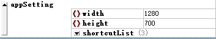
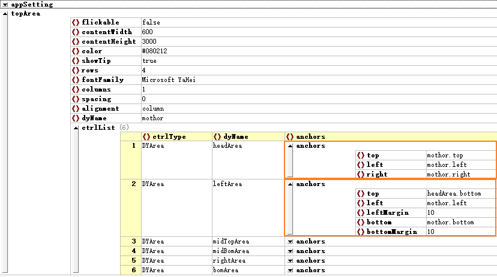
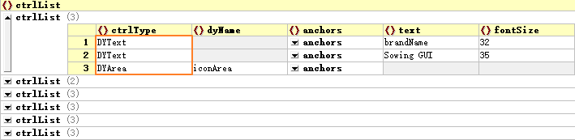
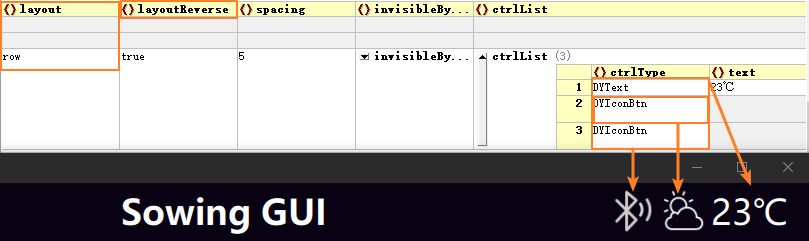

# Easy to get started with configuration files
[TOC]

The configuration file is a JSON format data file, so it is recommended to use a JSON file editing tool for modification. Do not attempt to edit JSON in source code format, as it can be very cumbersome and error prone. There are many similar JSON processing tools, and it is recommended to use XML Spy, which has the characteristics of being fast, stable, reliable, and easy to use, and can manage large JSON files. Of course, you can also choose other JSON editing tools that are commonly used. The screenshots of configuration files mentioned in the following article are all from XML Spy.

## I. Configuration File Structure

### 1.1 Top-Level Structure

Taking the **`Demo-SowingInterface-EN.json`** file as an example, let's explain step by step the composition of a GUI configuration file. Open this file with **XMLSpy** and switch to the mode of grid view. We can see the configuration file has only two top-level entries: **`appSetting`** and **`topArea`**.

- **`appSetting`**: Used to store the overall design information of the program, such as window size, global shortcuts, color space, etc.
- **`topArea`**: The container entry for the main window, which by default fills the entire window frame, and all other controls will be dynamically generated within this container.

As shown in the following figure:


### 1.2 Structure and Configuration of `appSetting`

#### 1.2.1 Configuring Window Size

Firstly, `appSetting` is not mandatory, but most projects typically require basic information configuration, unless you do not need to configure window size, shortcuts, etc., in which case you can completely omit the `appSetting` section. As this is a concise tutorial, we will only cover the configuration of window size and shortcuts.

To configure the window size, you add key-value pairs for width and height within the `appSetting`. Setting up shortcuts requires adding an array object named `shortcutList` within the `appSetting`. As shown in the following figure:



**If the project does not need to configure shortcuts, it is recommended that you skip directly to chapter 1.3 to learn the structure and configuration of the `topArea`. **If you need to configure shortcuts at the beginning, then you can go down in order.

#### 1.2.2 Configuring Shortcuts

Expand the `shortcutList` object to see its structure and configuration information:


A `shortcutList` is a JSON array, or ordered list, that can internally consist of one or more shortcut configuration objects. In the above example, the `shortcutList` contains three objects corresponding to the keyboard keys A, B and C. Pressing these shortcut keys, DYQML will emit a series of signals corresponding to them using the signaling system, and these signals are defined in the `dSignalList`. In other words, a shortcut key can send out multiple signals instead of only one. For example, the length of the `dSignalList` for the three shortcuts above is 3, so each of them can emit 3 signals. This is to increase the flexibility of the system to adapt to complex business needs, but it is not recommended to configure too many signals for one shortcut, just configure them according to the business needs. Click to expand the `dSignalList` to see the specific signal configuration information:


The signal body sent within the system is defined as `dSignal`. `dSignal` is a data structure for signal transmission defined in this project, and each `dSignal` must include at least the `sigId` information, which is the identifier of the signal. Without it, the signal will not be sent. Here, we do not need to understand too much about the setup of `dSignal`. It is sufficient to know that if `dSignal` is used, its signal identifier `sigId` must be configured, while the destination code `destCode` and the sub-information `subInfo` are not mandatory. For more detailed information about the system's signals and the signal system, you can refer to the article [Signal system composition]().

The program loads the above configuration information, with the window size set to 1280 by 700 pixels. There are three shortcut keys, corresponding to the keys A, B, and C. When key A is pressed, it will emit three signals to the QML interface, with the signal IDs being **xxxx-xxxx-a1**, **xxxx-xxxx-a2**, and **xxxx-xxxx-a3**, respectively. Similarly, pressing keys B and C will also emit three different signals each.

For comparison, the JSON source code for the above configuration information is as follows:

```json
"appSetting": {
    "width": 1280,
    "height": 700,
    "shortcutList": [
        {
            "keys": "A",
            "dSignalList": [
                {
                    "sigId": "xxxx-xxxx-a1",
                    "destCode": "100",
                    "subInfo": ""
                }, {
                    "sigId": "xxxx-xxxx-a2",
                    "destCode": "100",
                    "subInfo": ""
                }, {
                    "sigId": "xxxx-xxxx-a3",
                    "destCode": "100",
                    "subInfo": ""
                }
            ]
        }, {
            "keys": "B",
            "dSignalList": [
                {
                    "sigId": "xxxx-xxxx-b1",
                    "destCode": "100",
                    "subInfo": ""
                }, {
                    "sigId": "xxxx-xxxx-b2",
                    "destCode": "100",
                    "subInfo": ""
                }, {
                    "sigId": "xxxx-xxxx-b3",
                    "destCode": "100",
                    "subInfo": ""
                }
            ]
        }, {
            "keys": "C",
            "dSignalList": [
                {
                    "sigId": "xxxx-xxxx-c1",
                    "destCode": "100",
                    "subInfo": ""
                }, {
                    "sigId": "xxxx-xxxx-c2",
                    "destCode": "100",
                    "subInfo": ""
                }, {
                    "sigId": "xxxx-xxxx-c3",
                    "destCode": "100",
                    "subInfo": ""
                }
            ]
        }
    ]
}
```

### 1.3 Configuration of `topArea` and relationship with the `DYArea` Control

`topArea` is essentially an instantiated object of the container control `DYArea`. Its uniqueness lies in its position at the top layer of all other controls; it serves as the entry point for the dynamic creation of all other controls and, by default, fills the entire window. Within the entire DYQML system, there are two conventional container controls: `DYArea` and `DYForm`, with `DYForm` being a subclass of `DYArea`, inheriting all the characteristics of `DYArea` and possessing functionalities similar to an HTML Form. Generally, using `DYArea` as a container suffices. Special container class controls include `DYLoader`, `DYSwipePage`, which are more advanced applications and can be ignored for now.

All we need to know now is that `DYArea` is the most basic container control, inside which other controls can be placed. The `topArea` is a special instance of it, which is identical to the other features of `DYArea` except that it fills the form by default. Click to expand `topArea` and we can see information as below.


The `topArea` contains a series of properties, such as whether the area is flickable or not, the color, the font, etc. Let's ignore the other properties of the `topArea` for now and focus on the `ctrlList` field, which is a list of dynamically generated sub-controls within the `DYArea`. The specific value of `ctrlType` is the name of the control that `DYArea` supports (see Section 2.2 of this document - List of controls supported by `DYArea`).

In the **Demo-Sowing.json** file, the `topArea`'s `ctrlList` contains 6 child controls, and all 6 child controls are `DYArea` type controls. This means that in the top-level entry, 6 sub-areas are generated in a certain way, named `headArea`, `leftArea`, `midTopArea`, `midBomArea`, `rightArea`, and `bomArea`, which correspond to the 6 areas in the interface:


In this example, we have used an anchor-based layout scheme for the overall layout. The anchor positioning method is essentially the same as the anchor positioning method in QML itself, but here, we do not use the control's ID as the anchor identifier; instead, we use `dyName` for anchoring. The scope of anchoring is the same as in QML, where you can only anchor to a parent or sibling object, and you cannot exceed this range. Additionally, within this range, you must ensure the uniqueness of `dyName`. For the parent object to be anchored, you can use the more generic term `parent` as an identifier, in addition to the parent object's `dyName`. If you are not familiar with QML's anchor positioning method, It is recommend that you first acquire the necessary knowledge. The anchor positioning method is a very convenient way of positioning that will likely be used extensively in future configurations and development.

In addition to the anchor positioning method, DYQML also supports absolute positioning and layout positioning methods (Row, Column, Grid), which are introduced in Section 2.3. Expanding the `anchors` information of `headArea` and `leftArea`, you can see the following content, which is essentially consistent with QML's anchor positioning method.



Generally, it is recommended to configure `DYArea` controls within the `ctrlList` list of `topArea` for the overall layout of the interface, and then generate other controls within these `DYArea`s. It is not that `topArea` cannot generate other controls, but it is better to first determine the overall layout scheme. As previously introduced, `topArea` is just a special instance of `DYArea`, so `DYArea` and `topArea` have the same properties. After understanding the layout scheme, we can also set aside these properties and directly look at `CtrlList` fields of the 6 `DYArea`s. They are the same as the `CtrlList` of `topArea`, only that it begins to include other types of controls. For example, the expanded information of `headArea`'s `ctrlList` is shown in the following figure:



It contains two `DYText` controls and one `DYArea`, all of which are also laid out using the anchor-based positioning method. Their corresponding relationship with the interface is shown in the figure below:


A user interface can be designed in this hierarchical manner and combined into a complete page. It can be said that `DYArea` is the core component for organizing the interface. Within `DYArea`, you can generate all other controls, including generating `DYArea` itself, as well as generating advanced container controls like `DYForm`, `DYSwipePage`, and `DYLoader`. In the entire DYQML system, only `DYArea` and its derived class `DYForm` have this capability, and all other components exist in relation to these two.

Container controls like `DYLoader`, although they are more advanced container controls, are actually set up to be simple within the DYQML system. Although `DYLoader` can implement more advanced dynamic loading in the DYQML system, it can only dynamically load `DYArea` and not other controls. This is a deliberate restriction made by the DYQML system to keep the overall structure simple, with all components generated based on `DYArea` and its subclass `DYForm`. Both `DYLoader` and `DYSwipePage` can only generate `DYArea`, and then other controls are generated within the `DYArea`. Since this is a concise tutorial, we will not delve into other relatively complex controls here. Next, we will delve into the `DYArea` control and the types of controls it supports.

## II. Further Understanding of the `DYArea` Container Control

As a container control, `DYArea` is central to organizing page layout and dynamically generating controls. Mastering its basic configuration will essentially allow you to create the interface you desire. Therefore, this section continues to introduce the important configuration properties of `DYArea`, as well as the controls currently supported by `DYArea` for dynamic generation.

### 2.1 Important Properties of `DYArea`

`DYArea` currently supports a wide range of configurable properties. Here, only some important properties are introduced. See the table below:

<table>
    <tr>
        <th style="width: 10%;">Property Name</th>
        <th style="width: 10%;">Default Value</th>
        <th style="width: 10%;">Required</th>
        <th style="width: 70%;">Explanation </th>
    </tr>
    <tr>
        <td>ctrlType</td>
        <td>None</td>
        <td>Yes</td>
        <td>Identify the current control type, and DYQML determines the type of control to be created through this property. The type name of DYArea is DYArea.</td>
    </tr>
    <tr>
        <td>dyName</td>
        <td>None</td>
        <td>No</td>
        <td>The component name, and it is currently only used in anchoring relationships to determine the anchoring relationship between components.</td>
    </tr>
    <tr>
        <td>x</td>
        <td>None</td>
        <td>No</td>
        <td>In absolute positioning, the x-axis relative to the parent object is set. If x is set instead of anchors, DYArea adopts absolute positioning method.</td>
    </tr>
    <tr>
        <td>y</td>
        <td>None</td>
        <td>No</td>
        <td>In absolute positioning, the y-axis relative to the parent object is set. If y is set instead of anchors, DYArea adopts absolute positioning method.</td>
    </tr>
    <tr>
        <td>anchors</td>
        <td>None</td>
        <td>No</td>
        <td>Anchor positioning method refers to the anchoring method of DYArea itself relative to its parent and sibling objects.</td>
    </tr>
    <tr>
        <td>width</td>
        <td>200</td>
        <td>No</td>
        <td>The width of the DYArea, which currently only accepts numeric forms, not operators.</td>
    </tr>
    <tr>
        <td>height</td>
        <td>100</td>
        <td>No</td>
        <td>Height of the DYArea, currently only accepts numeric forms, not operators</td>
    </tr>
    <tr>
        <td>layout</td>
        <td>grid</td>
        <td>No</td>
        <td>Default is grid layout, this is for the child controls of DYArea, if the child controls in DYArea are not absolutely positioned (configured x,y) and anchored (configured anchors), then the child controls will be created and placed in grid (or row, column) layout in the order of the ctrlList. in the ctrlList.</td>
    </tr>
    <tr>
        <td>border.width</td>
        <td>0</td>
        <td>No</td>
        <td>Border width</td>
    </tr>
    <tr>
        <td>border.color</td>
        <td></td>
        <td>No</td>
        <td>Defaults to baseBorderColor in color space.</td>
    </tr>
    <tr>
        <td>ctrlList</td>
        <td>None</td>
        <td>No</td>
        <td>The list of subcontrols, too, is not required; at this point he is an empty area that occupies a certain amount of interface space.</td>
    </tr>
</table>

Other configurable properties supported by `DYAre`a can be viewed by opening **parseParameters.js** in the js directory and finding the property configurations for the `DYArea` case. All of these control properties have default values within the system, except for `ctrlType`, which is required, or their absence does not affect the generation. So you can configure only the `ctrlType` you need, and you can generate the corresponding control on the interface.

### 2.2 List of controls supported by `DYArea`

`DYArea` (`DYForm` is consistent with this) supports dynamically created controls including:

- `DYArea`: `DYArea` itself.
- `DYForm`: a form-like control.
- `DYDataShower`: a pure data display control.
- `DYLoade`r: derived from the QML Loader control, which can dynamically load other `DYArea`.
- `DYPlaceholder`: Placeholder control, which is useful in the row or grid layout scheme.
- `DYButton`: button
- `DYSwitch`: Toggle switch
- `DYComboBox`: drop-down menu.
- `DYConfirmBtn`: confirm send button, some commands need to be sent twice to confirm the situation
- `DYText`: plain text display
- `DYIconBtn`: Icon button.
- `DYBlinkDot`: Blinking dot control.
- `DYTextInput`: Text input control.
- `DYBusyIndicator`: Busy control
- `DYSlider`: Drag Bar
- `DYRadioButton`: radio box
- `DYCheckBox`: checkboxes
- `DYSwipePage`: Toggle paging control, can switch back and forth between multiple `DYArea` pages.
- `DYPopUp`: popup bar prompt, can show basic information of the system signal.

All of these controls can be configured in the `ctrlList` of a `DYArea` by assigning the name of the control above to the `ctrlType` field corresponding to one of the controls in the `ctrlList`.

### 2.3 Layout Schemes of `DYArea`

To effectively organize the interface, it is necessary to understand and master the layout schemes. `DYArea` is responsible for both the dynamic creation of controls and the implementation of internal layout schemes. This is not entirely consistent with QML settings, where grid, row, and column layout schemes are implemented using corresponding Grid, Row, and Column components. In DYQML system, these capabilities are all embedded within `DYArea`. In other words, `DYArea` inherently includes the above three layout components. These layout capabilities are part of the container functionality of `DYArea`, and users only need to configure the layout scheme used in a certain `DYArea` in the configuration file, without the need for specific development.

`DYArea` supports three basic layout schemes, which are: anchor-based layout scheme, absolute positioning layout scheme, and arrangement layout scheme. These three layout schemes can be used simultaneously within a single `DYArea`, with different controls potentially using different schemes for layout. A particular control can only use one scheme for layout. If a control uses multiple layout schemes simultaneously, the layout scheme with the highest priority will be chosen for layout according to the scheme's priority level.

The following table describes the three layout schemes and their priority levels:

<table>
  <tr>
    <th style=“width: 10%;”>Program Name</th>
    <th style=“width: 10%;”>Priority</th>
    <th style=“width: 80%;”>Description</th>
  </tr>
  <tr>
    <td>Anchored Layout Scenarios</td>
    <td>1</td>
    <td>Using QML's anchor positioning method, you can anchor a control to a parent or sibling object, which is the highest priority layout scheme. Be careful to distinguish between sibling objects of the current control. Sibling objects do not include control objects that are in the same DYArea but use an aligned layout scheme because the parent objects of these controls are actually Grids, Rows, and Columns in the DYArea, and therefore are not sibling objects. Anchored layout information needs to be configured within the specific child controls of the DYArea. </td>
  </tr>
  <tr>
    <td>Absolute positioning scheme</td>
    <td>2</td>
    <td>Using QML's absolute positioning method, just add the corresponding x and y key-value pairs to the corresponding control's configuration information. Absolute positioning is the second most preferred layout option after anchored positioning. Absolute positioning information should also be configured in the specific child controls of the DYArea. </td>
  </tr>
  <tr>
    <td>Arrangement Layout Schemes</td>
    <td>3</td>
    <td>Arrangement layout options include grid, row, and column layout options. You can add a layout field in DYArea's configuration information and select one of grid, row, or column layout. If there is no configuration, DYArea will choose grid scheme for layout by default. The arrangement layout scheme is configured within DYArea. </td>
  </tr>
</table>

The previous example has already introduced the anchor-based positioning method, and the configuration for absolute positioning is quite straightforward, so it will not be covered here. Below, still using the configuration file from the above example, I will explain the configuration method for the arrangement layout scheme. Taking the `iconArea` from the previous example, it arranges its child controls in a Row layout, and their corresponding relationship with the interface is shown in the following figure:



In this example, in addition to using the 'row' arrangement method, the `layoutRevers` is also set to true, which causes the child controls to be arranged from right to left. I would like to emphasize the priority of the layout scheme here again. For instance, the three child controls in this example are arranged sequentially by `iconArea` in a row, which is only valid if these three child controls have not been configured with anchor-based layout or absolute positioning layout. This is because the priority of the arrangement layout scheme is the lowest.

## III. Summary

Up to this point, this article has introduced the top-level structure of the JSON configuration file, detailed the basic configuration of `topArea` and `DYArea`, and finally discussed the important attributes of `DYArea`, the types of controls it supports, and the layout schemes it supports. On this basis, using `topArea` as the entry point and `DYArea` as the core element for organizing the interface, we can configure the interface program we desire. In the `configFiles` directory, there are some demos. You can take a closer look at how these configuration files are set up, understand the correspondence between these configuration details and the interface, which will help you configure your own configuration files. Alternatively, you can also make modifications based on these demo files, designing them into the interface you desire. If you wish to complete business logic through configuration, you will need to learn about the signal system in DYQML and the definition of the `dSignal` signal body based on the signal system. This will be introduced in the article [Signal system composition]().


