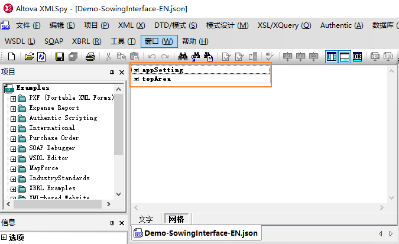
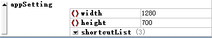
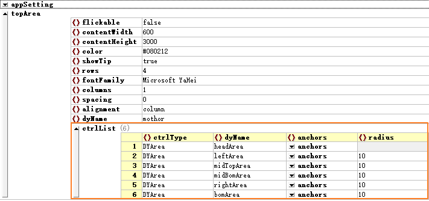
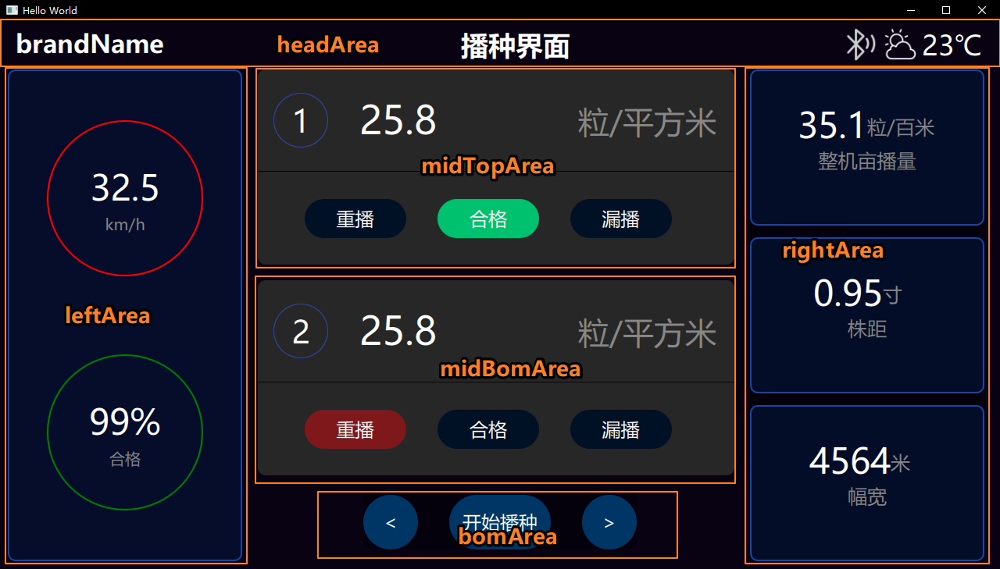
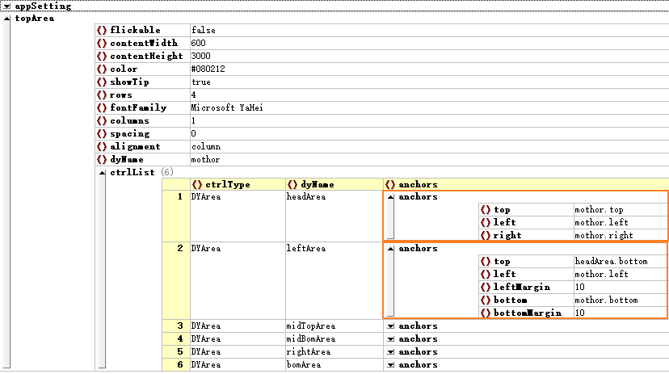
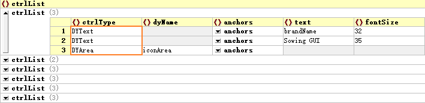
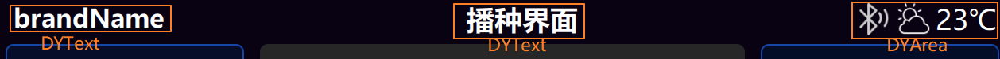
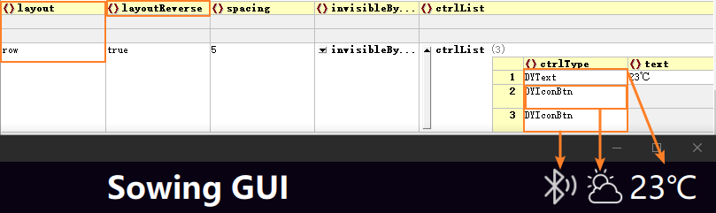

# 配置文件简单上手

[TOC]

配置文件为JSON格式的数据文件，因此建议使用JSON文件编辑工具进行修改。不要尝试使用源码形式编辑JSON，那样会非常繁琐易出错。类似的JSON处理工具有很多，建议使用XMLSpy，它具有快速、稳定、可靠、易用等特点，可以管理大型的JSON文件。当然你也可以选择其它用着习惯的JSON编辑工具。下面文章涉及到的截屏都来自XMLSpy。

## 一、配置文件结构

### 1.1 顶级结构

接下来以**Demo-SowingInterface-EN.json**文件为例逐步说明一个GUI配置文件的组成。使用XMLSpy打开该文件，并切换到网格模式。整个配置文件只有两个顶级入口：**appSetting**和**topArea**。

- **appSetting**：用于存储程序的整体设计信息，例如窗口尺寸、全局快捷键、颜色空间等
- **topArea**：主窗口的容器入口，它默认充满窗体，所有其他控件都会动态生成到这个容器内

如下图所示：

### 1.2 appSetting的结构和配置

#### 配置窗体尺寸

首先appSetting并不是必须的，但一般的工程项目都需要对它进行基本信息的配置，除非你不需要配置窗口尺寸、快捷键等，那完全可以不配置appSetting这一项。由于是简明教程，这里只介绍窗体尺寸的配置。

配置窗体尺寸的方法是在appSetting内添加width和height的键值对，如下图所示：

上图中的shortcutList是对快捷键的配置，具体内容参考文章：[快捷键与提示信息的配置](https://github.com/kongkongthu/DYQML6/blob/master/docs/6-快捷键与提示信息的配置.md)

### 1.3 topArea的配置及与控件DYArea的关系

topArea本质上是容器控件DYArea的一个实例化对象，它的特殊性只是在于它处于所有其他控件的顶层，它是动态创建其他所有控件的入口，同时它默认充满整个窗体。在整个DYQML系统中，常规容器控件一共有两个：DYArea和DYForm，且DYForm继承自DYArea，是DYArea的一个子类，具备DYArea所有的特性，同时具备类似html中Form表单的功能。一般来讲，我们只需要用DYArea作为容器即可。特殊的容器类控件包括DYLoader、DYSwipePage等，这些都属于更高级的应用，暂时不用理会。

我们现在只需要知道DYArea是最基本的容器控件，在其内部可以放置其他控件，topArea是它的一个特殊实例，除了默认充满窗体之外，与DYArea其他特性完全一致。点击展开topArea，可以看到下面的信息：

`topArea`中包含了一系列的属性配置信息，如区域是否可弹动，颜色、字体等。咱们暂时不用管topArea的其他属性配置，将精力更多聚焦于ctrlList字段。ctrlList是DYArea内动态生成的子控件列表。ctrlList中包含的控件，以ctrlType字段为标识进行区分。ctrlType的具体值为DYArea支持动态创建的控件的控件名（见本文2.2节-DYArea支持的控件列表）。

在Demo-Sowing.json文件中，topArea的ctrlList内包含6个子控件，且这6个子控件都是DYArea类型控件。这说明在顶级入口内，按一定方式生成了6个子区域，分别名为headArea、leftArea、midTopArea、midBomArea、rightArea、bomArea。他们分别对应界面上的6个区域：

在这个例子中，我们使用了锚定布局方案进行了整体布局。锚定定位方式与QML本身的锚定定位方式基本一致，但这里并不以控件的id作为锚定标识，而是以dyName为标识进行锚定。锚定的作用范围与QML一样，只能锚定到父对象或兄弟对象，不能超过这个范围，且在这个范围内要保证dyName的唯一性。对于要锚定的父对象，除了父对象的dyName，也可以使用更加通用的parent作为标识。如果你不了解QML的锚定定位方式，建议你先去掌握相关知识，锚定定位方式是一种非常方便的定位方式，在未来的配置和开发中应该会大量用到。

除锚定定位方式以外，DYQML还支持绝对定位方式以及排列布局定位方式（Row、Column、Grid），具体内容在2.3节进行介绍。展开headArea和leftArea的anchors信息，可以看到下面的内容，这些信息与QML的锚定定位方式基本上是一致的。

一般来说，建议在topArea的ctrlList列表内配置DYArea控件，进行界面的整体布局，然后再在这些DYArea内生成其他控件。当然并不是说topArea不可以生成其他控件，只是优先确定整体布局方案更好一些。前面已经介绍，topArea只是DYArea的一个特殊实例，因此DYArea与`topArea`具有相同的属性，在了解了布局方案之后，我们也可以先抛开这些属性，直接看他们的CtrlList字段。与topArea的ctrlList完全一样，只是里面开始出现了其他控件类型。例如，headArea的ctrlList展开信息如下图所示：

这里面包含两个DYText和一个DYArea，且也都是采用锚定定位方式进行的布局。它们与界面的对应关系如下图所示：

一个界面就可以被这样逐级设计深入，并组合成一个完整的页面。可以说DYArea是组织界面的核心组件。在DYArea内可以生成其他所有控件，包括生成DYArea自身，也可以生成DYForm、DYSwipePage和DYLoader这样的高级容器类控件。在整个DYQML系统中，只有DYArea以及继承自它的DYForm具备这种能力，其他组件都依附于它们两个而存在。

像DYLoader这样的容器控件，虽然是更高级的容器类控件，但是DYQML对它的设定反而是简单的。在DYQML系统中，DYLoader虽然可以实现更高级的动态加载，但它只能动态加载DYArea，而不能加载其他控件。这是DYQML系统特意作出的限制，目的是让整个系统的结构简单，所有组件都基于DYArea及其子类DYForm生成。DYLoader与DYSwipePage都只能生成DYArea，然后在DYArea内在生成其他控件。因为这是简明教程，其他相对复杂的控件不在这里深入。接下来将会深入介绍DYArea控件及其支持的控件类型。

## 二、进一步了解DYArea容器控件

DYArea作为容器控件，是组织页面布局以及动态生成控件的核心。掌握了它的基本配置，就基本可以配制出你想要的界面。因此本节继续介绍DYArea的重要配置属性，及目前DYArea支持动态创建的控件。

### 2.1 DYArea的重要属性

DYArea目前支持的可配置的属性很多，这里只介绍一些重要的属性。见下表：

<table>
    <tr>
        <th style="width: 10%;">属性名</th>
        <th style="width: 10%;">默认值</th>
        <th style="width: 10%;">必要</th>
        <th style="width: 70%;">解释</th>
    </tr>
    <tr>
        <td>ctrlType</td>
        <td>无</td>
        <td>是</td>
        <td>标识当前控件类型，DYQML通过该属性确定所需创建的控件类型，DYArea的类型名就是DYArea</td>
    </tr>
    <tr>
        <td>dyName</td>
        <td>无</td>
        <td>否</td>
        <td>组件名称，目前只有在锚定关系中才用到dyName，用于确定组件之间的锚定关系</td>
    </tr>
    <tr>
        <td>x</td>
        <td>无</td>
        <td>否</td>
        <td>绝对定位中相对于父对象的横坐标x，若未设置anchors而设置了x，则DYArea采用绝对定位方式</td>
    </tr>
    <tr>
        <td>y</td>
        <td>无</td>
        <td>否</td>
        <td>绝对定位中相对于父对象的纵坐标y，若未设置anchors而设置了y，则DYArea采用绝对定位方式</td>
    </tr>
    <tr>
        <td>anchors</td>
        <td>无</td>
        <td>否</td>
        <td>锚定定位方式，指的是DYArea自身相对于父对象与兄弟对象的锚定方式</td>
    </tr>
    <tr>
        <td>width</td>
        <td>200</td>
        <td>否</td>
        <td>DYArea的宽度，目前只接受数字形式，不接受运算符</td>
    </tr>
    <tr>
        <td>height</td>
        <td>100</td>
        <td>否</td>
        <td>DYArea的高度，目前只接受数字形式，不接受运算符</td>
    </tr>
    <tr>
        <td>layout</td>
        <td>grid</td>
        <td>否</td>
        <td>默认为grid布局，这是针对DYArea的子控件而言的，如果DYArea内的子控件未使用绝对定位方式（配置了x,y），也为进行锚定布局(配置了anchors)，则该子控件将会按照在ctrlList内的顺序依次创建并被放置到grid（或row、column）布局中。</td>
    </tr>
    <tr>
        <td>border.width</td>
        <td>0</td>
        <td>否</td>
        <td>边框宽度</td>
    </tr>
    <tr>
        <td>border.color</td>
        <td></td>
        <td>否</td>
        <td>默认值为颜色空间中的baseBorderColor</td>
    </tr>
    <tr>
        <td>ctrlList</td>
        <td>无</td>
        <td>否</td>
        <td>子控件列表也不是必须的，此时他就是一个空的区域，占据一定的界面空间。</td>
    </tr>
    <tr>
        <td>flickable</td>
        <td>false</td>
        <td>否</td>
        <td>区域是否可以弹动，该属性决定是否在DYArea中添加一个Flickable区域，并将控件生成到这个Flickable区上去。在未来的文档中将会详细介绍该属性。</td>
    </tr>
</table>

DYArea支持的其他可配置属性可以打开js目录下的parseParameters.js，找到DYArea情况下的属性配置进行查看。这些控件属性除了ctrlType是必须的之外，其他属性在系统内都有默认值，或者缺失也不影响生成。因此你可以只配置需要的ctrlType，一般就可以在界面上生成对应的控件了。

### 2.2 DYArea支持的控件列表

DYArea（DYForm与此一致）支持动态创建的控件包括：

- DYArea：DYArea自身
- DYForm：类似表单的控件
- DYDataShower：纯数据显示控件
- DYLoader：源自QML Loader控件，可以动态加载其他DYArea
- DYPlaceholder：占位控件
- DYButton：按钮
- DYSwitch：切换开关
- DYComboBox：下拉菜单
- DYConfirmBtn：确认发送按钮，某些指令需要二次确认发送的情况
- DYText：纯文本显示
- DYIconBtn：图标按钮
- DYBlinkDot：闪烁的圆点控件
- DYTextInput：文字输入控件
- DYBusyIndicator：繁忙控件
- DYSlider：拖动条
- DYRadioButton：单选框
- DYCheckBox：复选框
- DYSwipePage：切换分页控件，可在多个DYArea页面来回切换
- DYPopUp：弹出条提示器，可以显示系统发出的信号

这些控件都可以被配置到DYArea（包括topArea）的ctrlList列表内，将上面的控件名称配置到ctrlList列表内某一个控件对应的ctrlType字段。

### 2.3 DYArea的布局方案

要很好的组织界面，了解并掌握布局方案是必要的。DYArea同时承担了控件的动态创建和内部布局方案的实现两个方面的内容。这与QML的设定并不完全一致，在QML中，grid、row、column布局方案使用对应的Grid、Row、Column组件来实现，而在DYQML系统中，将这些能力都内嵌到了DYArea中。换句话说，DYArea中默认嵌入了上面三种布局组件。这些布局能力是DYArea作为容器功能的一部分，用户只需要在配置文件中配置某个DYArea中使用的布局方案，不需要用户特意开发。

DYArea支持三种基本的布局方案，它们分别是：锚定布局方案、绝对定位布局方案、排列布局方案。这三种布局方案可以在一个DYArea中同时使用，不同的控件可以使用不同的方案进行布局，某一个控件只能使用某一种方案进行布局。如果一个控件同时使用了多种布局方案，则按照方案的优先级，选择优先级高的布局方案进行布局。

下表描述了三种布局方案及其优先级：

<table>
  <tr>
    <th style="width: 10%;">方案名称</th>
    <th style="width: 10%;">优先级</th>
    <th style="width: 80%;">描述</th>
  </tr>
  <tr>
    <td>锚定布局方案</td>
    <td>1</td>
    <td>使用QML的锚定定位方式，可以将某个控件锚定到父对象或兄弟对象，是优先级最高的布局方案。注意区分当前控件的兄弟对象，兄弟对象不包含同在一个DYArea内但使用排列布局方案的控件对象，因为这些控件的父对象实际上是DYArea内的Grid、Row、Column，因此并不是其兄弟对象。锚定布局信息需配置到DYArea具体的子控件内。</td>
  </tr>
  <tr>
    <td>绝对定位方案</td>
    <td>2</td>
    <td>使用QML的绝对定位方式，在对应的控件配置信息中添加对应的x、y键值对即可。绝对定位方式是优先级仅次于锚定定位方式的布局方案。绝对定位信息也需配置在DYArea具体的子控件内。</td>
  </tr>
  <tr>
    <td>排列布局方案</td>
    <td>3</td>
    <td>排列布局方案包括grid、row、column三种布局方案，可以在DYArea的配置信息中添加layout字段，并选择grid、row、column三种中的某一种进行布局。如果没有配置，则DYArea会默认选择grid方案进行布局。排列布局方案配置在DYArea内。</td>
  </tr>
</table>

前面的例子已经介绍了锚定定位方式，而绝对定位方式的配置很简单，这里不进行介绍。下面仍然以上面例子中的配置文件为例，介绍排列布局方案的配置方式。以上面例子中的iconArea为例，它内部是按照Row的方式排布子控件，他们与界面的对应关系如下图所示：

这个例子中，除了使用了row这种排布方式，还将layoutReverse设置为true，这样子控件就会从右至左依次排列了。在这里再强调一下布局方案的优先级，比如这里的三个子控件被iconArea按照row的方式依次排列开，这是在这三个子控件没有再配置锚定布局或绝对定位布局的前提下才有效，因为排列布局方案的优先级是最低的。

## 三、总结

到此，本文介绍了json配置文件的顶级结构，详细介绍了topArea以及DYArea的基本配置，最后介绍了DYArea的重要属性、支持的控件类型以及支持的布局方案。在此基础上，以topArea为入口，以DYArea为组织界面的核心元素，我们就可以配置自己想要的界面程序了。在`configFiles`目录下有很多demo，你可以多看看这些配置文件是如何配置的，了解这些配置信息与界面的对应关系，这会有助于你配置自己的配置文件。或者你也可以在这些demo文件的基础上进行修改，将它们设计成你想要的界面。如果你还想要通过配置完成业务逻辑，则需要学习DYQML中的信号系统以及基于信号系统的dSignal信号体的定义。这将在文章[信号系统构成](https://github.com/kongkongthu/DYQML6/blob/master/docs/3-信号系统构成.md)中介绍。

