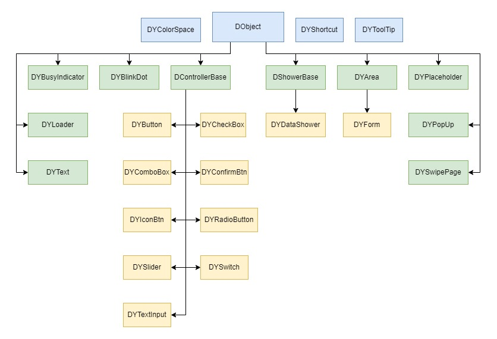

# Control System Composition and Customize Controls

[TOC]

---

## System Composition

In the DYQML system, except for a few special controls (`DYColorSpace`, `DYShortcut`, `DYToolTip`), the base class of all controls used for dynamically generated controls is `DObject`, which standardizes the basic attributes and methods of dynamically generated controls in the system, such as `ctrlType`, `dyName`, `dyAnchors`, etc., and also contains the basic responses to signals, such as show and hide, enable and disable, etc. All other controls inherit from `DObject`, making them derived classes of it, or derived classes of its derived classes.

The following diagram depicts the inheritance relationships of the controls currently included in the system:



From the diagram, we can see that apart from the `DYColorSpace`, `DYShortcut`, and `DYToolTip` controls, all other controls inherit from `DObject`. The two most important derived classes of `DObject` are `DControllerBase` and `DShowerBase`, which serve as the base classes for control-type controls and data display-type controls, respectively. Control-type controls are those that do not display real-time data but emit signal commands, such as buttons, checkboxes, dropdown menus, etc. These controls generate user events during user operations, and such user events emit signals externally. Display-type controls are used for displaying data; they obtain data in real-time from the data system composed of DYQML's hash tables and refresh the interface display.

The `DObject` class is essentially a QML `Rectangle` control. The main reasons for choosing `Rectangle` over `Item` include:

1. Although the `Item` component is more fundamental and simpler, and it is the parent class of `Rectangle` with the basic characteristics of `Rectangle`, `Item` itself does not have a color property. For the vast majority of requirements, control colors, including border colors, are essential, and using `Item` cannot meet this need.
2. `Rectangle` itself is also sufficiently simple, without too many complex and unnecessary properties and methods, and it can serve as a container to hold or dynamically generate other controls.


Currently, there are the most controls in the system that inherit from `DObject` and `DControllerBase`. You can use the code of these controls as an example to start developing your own controls.

## Customizing Controls

To take full advantage of DYQML's features, utilize DYQML's signaling system with event responses, and take full advantage of dynamic customization capabilities, it is very wise to make your controls inherit from the classes `DObject`, `DControllerBase`, and `DShwerBase`. Otherwise your controls will most likely not be able to properly use the dynamically generated features and capabilities of the DYQML system, and will not be able to effectively utilize DYQML's signaling system, making them less capable.

In addition to customizing controls, you need to have a relative understanding of QML, know and can use the basic control types of QML. DYQML does not recommend but also does not exclude the use of `Control`-based control design, but in order to ensure the system performance and code neatness, the use of `Item`-based basic control types, basically, you can build any control you want.

On this basis, you can complete the customization of a control and incorporate it into the DYQML system through the following simple steps. The following is an example of `DYText` to demonstrate the general steps of customizing a control:

- **Step 1 - Create a new QML control file:** Based on the functionality of the control, create a new QML file in the `/qml/controls` directory. Pay attention to naming the file in the form of `DYCtrlName.qml` (e.g., `DYText.qml`) for better management. The file name must start with a capital letter, otherwise, the Qt system will not recognize it.

- **Step 2 - Choose the inheritance relationship:** Determine the control's inheritance relationship and start writing the code based on the parent class, such as `DYText` inheriting from `DObject`. Set the control's id (not mandatory, but useful for designing the control as the code within the control may use this id). Try to keep the id name consistent with the file name but in lowercase. In QML, the first letter of the id must be lowercase; otherwise, Qt system will report an error. For example, the id of `DYText` should be `dyText`. The specific code is: "

  ```qml
  // DYText.qml
  import QtQuick 2.15
  DObject {
      id: dyText
  }
  ```

- **Step 3 - Design Controls:** Design the properties, appearance, and functionality of the controls. Below is the complete code for `DYText`. This step purely involves designing the control itself using QML and JS. These custom properties typically need to be configured in a configuration file, such as the text and `fontSize` properties below.

  ```js
  import QtQuick 2.15
  DObject {
      id: dyText
      color: "#00000000"
      property string text
      property int fontSize
      property color fontColor
      property bool fontBold
      property string textHAlignment
      property string textVAlignment
  
      Text {
          id: innerText
          anchors.fill: parent
          text: qsTr(dyText.text)
          color: fontColor
          font.pixelSize: fontSize
          font.bold: fontBold
          font.family: frontEnd.fontFamily
      }
  
      Component.onCompleted: {
          _initTextHAlignment();
          _initTextVAlignment();
      }
  
      function _initTextHAlignment(){
          switch(textHAlignment){
          case "left":
              innerText.horizontalAlignment = Text.AlignLeft;
              break;
          case "right":
              innerText.horizontalAlignment = Text.AlignRight;
              break;
          case "center":
              innerText.horizontalAlignment = Text.AlignHCenter;
              break;
          default:
              innerText.horizontalAlignment = Text.AlignLeft;
              break;
          }
      }
  
      function _initTextVAlignment(){
          switch(textVAlignment){
          case "top":
              innerText.verticalAlignment = Text.AlignTop;
              break;
          case "bottom":
              innerText.verticalAlignment = Text.AlignBottom;
              break;
          case "center":
              innerText.verticalAlignment = Text.AlignVCenter;
              break;
          default:
              innerText.verticalAlignment = Text.AlignTop;
              break;
          }
      }
  }
  ```

- **Step 4 - Adding Attribute Assignments:** Add attribute assignments in the `parseParas()` function in `parseParameters.js`. These attributes can be either QML built-in attributes or attributes added by developer. For example, the `DYText` control added the following attributes:

  ```js
  property string text
  property int fontSize
  property color fontColor
  property bool fontBold
  property string textHAlignment
  property string textVAlignment
  ```

  

  When assigning attributes in `parseParameters.js`, it is strongly recommended to assign default values to control properties at this step. This is typically achieved using ternary operators. This ensures that if the configuration file does not specify corresponding attributes, the control will default to certain values. Below is the attribute assignment situation for `DYText`:

  
  
  ```js
  case "DYText":
      paras2 = {
          "text": ctrlJson.text ? ctrlJson.text : "NoText",
          "width": typeof(ctrlJson.width) === "number" ? ctrlJson.width : 100,
          "height": typeof(ctrlJson.height) === "number" ? ctrlJson.height : 30,
          "color": ctrlJson.color ? ctrlJson.color : colorSpace.fullTransparentColor,
          "fontSize": ctrlJson.fontSize ? ctrlJson.fontSize : 12,
          "fontBold": ctrlJson.fontBold,
          "fontColor": ctrlJson.fontColor ? ctrlJson.fontColor
          : colorSpace.primaryFontColor,
          "textHAlignment": ctrlJson.textHAlignment ? ctrlJson.textHAlignment : "left",
          "textVAlignment": ctrlJson.textVAlignment ? ctrlJson.textVAlignment : "top",
      }
      break;
  ```
  
- **Step 5 - Adding as a Component of `DYArea`:** Adding the control as a Component to `DYArea` and dynamically generating it mainly involves the following two steps:

  - Creating a Component: Use `Qt.createComponent()` to add the control as a Component of `DYArea`.
  - Creating an Object: Add the dynamic creation process in the `generateSubCtrls()` function using `Component.createObject()`.

If you're not familiar with QML's Component and Object, don't worry. Just follow the code below. Simply put, Component is similar to the concept of a class, and `createComponent` is akin to importing the class into the current control. Then, `createObject` is used to create a specific Object. According to Qt's definition, a Component won't appear in the interface until an object is created.


```js
// DYArea.qml
// create Component
  property Component dyTextComp: Qt.createComponent("DYText.qml")
  ...
  // create object dynamically (in function of generateSubCtrls())
  case "DYText":
      ctrlObj = dyTextComp.createObject(objParent, paras);
      break;
```


`objParent` is the parent object for the dynamically generated `DYText` object `ctrlObj`, and `paras` are the property values obtained from performing attribute value assignments. `Component.createObject()` dynamically generates a component based on these two parameters.

With this, we have completed the customized development of a control and integrated it into the DYQML ecosystem. After this, the control can be configured and dynamically generated under a `DYArea` in a JSON configuration file.

## Control Naming Conventions

In DYQML, apart from some basic controls (such as `DObject`, `DShowerBase`, `DControllerBase`) that start with an uppercase letter "D", other controls all begin with "DY" followed by the control name. DYQML strives to maintain consistent control names throughout the system, so the control name will be consistent from the filename to the configuration file. Therefore, when customizing your own controls, ensure that the names in Step 1, Step 4, and Step 5 of the previous section are consistent. For example, the filename **`DYText.qml`** should match the **`DYText`** in Step 4 and Step 5. Doing so allows developers to have a clear correspondence when working with configuration files and enhances the readability of the configuration files.


