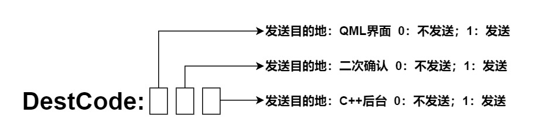

# 信号系统构成

[TOC]

---

## 一、综述

Qt的一大特性就在于它拥有强大稳定的信号系统，QML与QWidget一样，甚至拥有更灵活的信号与槽机制。不过过于灵活的信号通常让人无所适从，用不好还会导致程序的信号随着开发的深入越来越混乱.对于刚刚开始使用Qt的开发者来说，这是往往是比较痛苦的。如果项目缺乏有效管理，Qt的信号就像是屎山代码里面的一条条蛆虫（有点恶心，但很形象，呵呵），你还要顺着它们去找到它们的来龙去脉，那种感觉不言而喻。

为此，DYQML对整个项目的信号系统进行了合理而强力的规范，所有信号都通过这套信号系统进行分发，让信号系统可以清晰明了、有条不紊的开展工作。使用DYQML配置自己的项目，应该了解他的信号系统，在信号系统的基础上，我们可以完成几乎所有业务逻辑的配置工作。

---

## 二、信号与信号的发送

### 2.1 信号体dSignal

在DYQML的信号系统中传递的信息采用统一的信号结构进行规范，我们将信息的具体内容定义为信号体dSignal。下面是dSignal的数据结构：

```json
{
    sigId: "your-signal-id", // 必要
    destCode: "100", //非必要
    subInfo: {}, //非必要
}
```

其中sigId是必须的，这是一个信号的标识，在DYQML整个系统中所有动态生成的控件都是通过识别该标识并对对应的信号作出响应的。dSignal是DControllerBase组件的一个基本属性，因此继承自它的控件都拥有该属性，并通过定制开发让用户可以在配置文件中配置对应发送的dSignal具体信息。

```qml
// DControllerBase.qml

import QtQuick 2.15

DObject {
    id: controllerBase
    dyType: "controller"
    property var crtInfo:({})
    property var dSignal:({"sigId":"", "destCode":"100", "subInfo":{}})
    property string fieldName
    property var fieldInfo: ({})
}
```

### 2.2 三个信号

在DYQML中，界面上所有的信号发送都是通过Main.qml中的定义的三个信号完成的，他们分别为：

- sigTriggerGUI(var dSignal)：用于触发界面响应的信号
- sigTriggerConfirm(var dSignal)：用于触发二次确认后在发送给后台C++的信号
- sigTriggerBackEnd(var dSignal)：用于发送给后台C++的信号

其实我们也不需要手动调用这三个信号，DYQML定义了一个信号分发器，它是js目录下的procEmitSignal.js中定义的emitSignal()函数。这个函数会解析dSignal然后决定将dSignal通过上面三个中的哪个信号发送出去。我们可以将该函数认为是DYQML系统的信号分发中枢。我们只需要在需要发出信号时，引入该js文件并调用该函数，下面的代码是DYSwitch被触发时调用信号分发器的例子：

```js
//DYSwitch.qml
import QtQuick 2.15
import QtQuick.Controls 2.15
import "./../js/procEmitSignal.js" as EmitSignal //引入信号分发器

DControllerBase {
    id: dySwitch
    ...
    Connections{
        target: control
        function onCheckedChanged() {
            verifyTextPos();
            formFieldInfo();
            emitSwitchStatus();
        }
    }

    function emitSwitchStatus(){
        if(sigId){
            if(control.checked)
                dSignal["sigId"] = sigId + "-ON";
            else
                dSignal["sigId"] = sigId + "-OFF";
            EmitSignal.emitSignal(dSignal); //调用分发器
        }
    }
    ...
}
```

### 2.3 信号分发器详解

信号分发器emitSignal()函数能够根据dSignal内的信息知道该如何发送信号，这是由dSignal中的destCode字段决定的。我们可以想想一下，系统中任何一个信号的发出，在发出之前，我们都是已经明确了这个信号的默认接收方会是谁，我们知道这个信号发出之后希望谁会接收到这个信号并作出反应。DYQML的信号系统让dSignal包含了基本的传送目的地信息destCode，并与信号其它信息一起传递了出去。我们可以再看看dSignal的基本数据结构：

```json
{
    sigId: "your-signal-id", // 必要
    destCode: "100", //非必要
    subInfo: {}, //非必要
}
```

对于一个dSignal信号对象来说，只有sigId是必要的。只要有了sigId，这个信号体就可以通过信号分发器发送出去。subInfo是附加在这个信号体内的数据，你可以添加任何你想要的数据并将其发送出去。需要重点理解的是destCode的编码含义，destCode是目标码的意思，信号分发器通过destCode来分发信号。如前所述，DYQML发送信号分为三种，分别用于将信号发送给界面、二次确认控件、C++后台。我们可以将这三者视为信号的发送目的地destination。destCode中设置的字符串共有三个字符，每个字符的位置代表一个目的地，0代表不发送给这个目的地，1代表发送给这个目的地。例如"100"代表只发送给界面GUI不发送给二次确认控件和C++后台，"101"代表既发送给GUI又发送给C++后台，其他同理。如果没有设置destCode，则默认为"100"，发送给界面。



由于所有继承自DControllerBase的控件都默认拥有dSginal属性，因此我们可以在配置文件中配置dSignal并加载到程序中。以下图为例，该控件配置了一个名为"SWITCH-TO-SPECIFIED-FONT-FAMILY"，并且在subInfo中添加了fontFamily信息为微软雅黑。该sigId是一个系统预设id，通过它和subInfo中的字体信息，可以切换整个界面使用的字体。你可以任意指定自己的sigId，用于触发自己的事件响应。在本文的附录，介绍了系统预设的sigId，大家可以调用。


### 2.5 C++后台发信号给界面

C++后台发信号给界面，一般性的目的是为了触发界面发生反应和动作。目前C++后台通过同样的信号分发机制发送信号给前台。具体的调用方法定义在C++的QmlInterface类内，该类是面向QML的一个接口类，通过它的实例化对象，通过调用triggerQML()方法将后台想要发送的dSignal发送到界面。

```c++
public:
	void triggerQML(QVariantMap dSignal);
```

这里dSignal的结构与前面说的完全一致，在C++后台它是QVariantMap类型的数据。QVariantMap类型数据在传递给QML的时候会自动转变成json格式，使用起来很方便。

## 三、信号的接收

发出的信号是上面提到的三种信号，分别发送给三个不同的目的地——界面、界面上的二次确认控件、C++后台。信号的接收被DYQML进一步精简了，将发送给界面与发送给二次确认控件的信号统一合并为发送给前端的信号，这样除了界面上特殊的控件，只需要响应这个发送给前端的信号即可。

### 3.1 发送给前端信号的接收

前端信号的接收定义在各个动态生成的控件内，以DObject为例：

```js
Connections{
    target: frontEnd
    function onSigTriggerFrontEnd (dSignal){
        procStatusOnSignal(dSignal);
        postProcStatusOnSignal(dSignal);
    }
}
```

使用Connections，将目标设置为frontEnd，也就是Main.qml的id，然后用响应槽函数来响应对应的信号并进行对应的处理即可。

### 3.2 发送给后端信号的接收

C++后台负责接收发送给后端的信号，通过在main.cpp中实例化的DYBackEnd对象backend来接收信号，在main.qml中通过调用backend的receiveFromQml()函数来讲dSignal信号发送给后端。之后就是负责后台C++开发的开发者要去负责处理这个函数响应了。目前DYQML的backend对象只负责接收了信号数据，并没有进行任何处理。建议相关开发者也先定义一个dSignal的解析器，通过解析的dSignal信号来进行不同的处理。

```qml
function onSigTriggerFrontEnd(dSignal){
    function onSigTriggerBackEnd(dSignal){
    	console.log(`signal trigger backend, and dSignal = ${
    		JSON.stringify(dSignal)
    	}`);
    	backend.receiveFromQml(dSignal); //调用后台的receiveFormQml函数
    }
}
```

## 附：系统预设sigId

目前系统只预设了两个信号的id，他们分别为：

- "SWITCH-TO-SPECIFIED-FONT-FAMILY"：用于切换界面字体

- "SET-COLORSPACE"：用于设置颜色空间，具体颜色信息在subInfo内设置，关于具体的颜色空间包括哪些基本颜色属性，可以看见DYColorSpace.qml

  ```qml
  QtObject{
      property string brandColor: "#177ddc"
      property string darkerTransBrandColor: "#a0177ddc"
      property string semiTransBrandColor: "#80177ddc"
      property string lighterTransBrandColor: "#50177ddc"
      property string primaryColor: "#333"
      property string secondaryColor: "#555"
      property string lightColor: "#777"
      property string lighterColor: "#999"
      property string successColor: "#67c23a"
      property string warningColor: "#e6a23c"
      property string dangerColor: "#f56c6c"
      property string semiTransSuccessColor: "#8067c23a"
      property string semiTransWarningColor: "#80e6a23c"
      property string semiTransDangerColor: "#80f56c6c"
      property string primaryFontColor: "#fff"
      property string regularFontColor: "#dcdcdc"
      property string secondaryFontColor: "#ccc"
      property string placeholderFontColor: "#aaa"
      property string baseBorderColor: "#ccc"
      property string lightBorderColor: "#bbb"
      property string lighterBorderColor: "#aaa"
      property string extraBorderColor: "#999"
      property string backgroundColor: "#333"
      property string lightBackgroundColor: "#444"
      property string lighterBackgroundColor: "#555"
      property string primaryDisableColor: "#777"
      property string secondaryDisableColor: "#999"
      property string fullTransparentColor: "#00000000"
      property string halfTransparentColor: "#50000000"
  }
  ```

  