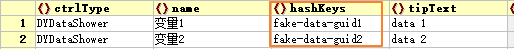

# 实时数据与统一定时器

[TOC]

对于实时更新的数据建议使用DYQML的实时数据系统，并通过frontend定义的统一定时器`freshTimer`，在需要实时数据显示的控件内定时获取数据并刷新界面显示。使用这套实时数据显示系统可以规范界面数据更新，可以更好更简单的维护数据，让数据的维护更新与显示刷新更高效。

---

## 一、实时数据系统与实时数据的数据结构

### 1.1 Hash表与方法定义

实时数据系统的核心是通过Hash表来管理数据，该哈希表定义在**`DYBackEND`**类内，是它的一个私有变量，同时面向QML开放了四个读取Hash表数据的接口函数：

```c++
Q_INVOKABLE QVariant getHashDataObj(QStringList dataIdList);
Q_INVOKABLE QVariantList getHashDataList(QStringList dataIdList);
Q_INVOKABLE QVariant getHashData(QString dataId);
Q_INVOKABLE QVariant getHashDataItem(QString dataId, QString itemName);
```

在实际使用中，我们没必要直接使用它们，因为在QML端，在js目录下的readHash.js文件内定义了面向上面四个接口函数的调用方法，自定义的QML控件只需要引入该js文件并调用里面的方法即可。readHash.js定义的方法主要包括：

```js
// 读取多个key值对应的哈希表value，返回value值的列表，每个value是一个json对象，
// 若只有一个key，则只返回对应的value的json对象
function readHashData(hashKeys)

// 读取多个key值对应的哈希表value，并从value中挑出对应的itemName项的数据，将这
// 些数据组成一个列表返回，若只有一个key，则只返回哈希表中对应的itemName项的数据
function readHashDataItem(hashKeys, itemName)

// 与readHashData()方法类似，只是返回的是以key为键的json对象，而不是json列表
function readHashDataObj(hashKeys)
```

上面三种方法都支持一次读取多个key，也都支持只读取一个key，可以根据需要使用上面三种方法。

### 1.2 key、`dataId`与GUID

这里的key就是C++定义的`dataId`，请保证他们在hash表内的唯一性。整个DYQML系统通过`dataId`管理和访问hash表中的每个数据。如果数据量巨大，比如超过100项以上的数据，就推荐使用全局唯一标识符GUID来确保唯一性。有很多软件和工具都可以生成GUID，对生成的GUID进行统一管理，会大大简化你的工程项目。

GUID的格式为`xxxxxxxx-xxxx-xxxx-xxxx-xxxxxxxxxxxx`，其中每个 x 是 0-9 或 a-f 范围内的一个[十六进制](https://baike.baidu.com/item/十六进制/4162457?fromModule=lemma_inlink)数。如：TY961D5F-8B7T-YUH8-BB5T-T5TI6VB9S5NL。有的软件生成的字母全都是大写，有的是小写，都可以，都不影响使用。

## 二、C++后台维护哈希表的方法

C++后台负责维护这个哈希表，将你需要的数据推入到哈希表中，并维护数据更新。维护哈希表的方法可以参考`C++/fakeFunction/genfakehashdata.cpp`。这是一个生成哈希表假数据的类，可以让QML界面获取动态变化的假数据，实际工程项目中数据应来自实际的数据源，如网络、数据采集设备、采集卡等。下面是genfakehashdata.cpp生成并更新hash表的代码：

```c++
#include "genfakehashdata.h"

GenFakeHashData::GenFakeHashData(QHash<QString, QVariantMap> *dyHash, QObject *parent)
{
    this->_dyHash = dyHash;
}

void GenFakeHashData::startGenData()
{
    this->_genTimer = new QTimer(this);
    this->connect(this->_genTimer, SIGNAL(timeout()), this, SLOT(gengerating()));
    this->_genTimer->start(200);
}

void GenFakeHashData::gengerating()
{
    QString rawDataId = "fake-data-guid";
    QString dataId;
    QString valueName;
    QString unit = "m";
    double value;
    QVariantMap dataInfo;

    for (int i = 0; i < 100; ++i) {
        dataId = rawDataId + QString::number(i);
        valueName = "变量" + QString::number(i);
        if(i % 4 == 1)
            unit = "cm";
        else if(i % 4 == 2)
            unit = "º";
        else if(i % 4 == 3)
            unit = "℃";
        value = QRandomGenerator::global()->bounded(100.00);
        dataInfo["name"] = valueName;
        dataInfo["value"] = value;
        dataInfo["unit"] = unit;
        if(_dyHash->contains(dataId))
            _dyHash->remove(dataId);
        _dyHash->insert(dataId, dataInfo);
    }
}

```

目前在哈希表的数据中，只包含了三种信息，即"name"、"value"、"unit"（这里的value是指实际的数据数值，而不是上面提到的哈希表键值对中的value，哈希表的value是与key相对应的专有概念，不要混淆）。使用中需要注意的是每次更新哈希表的时候，需要删除原来已有的键值对，否则Qt哈希表不会自动删除旧数据，最后导致内存溢出。因此重点是下面三条语句：

```c++
if(_dyHash->contains(dataId))
    _dyHash->remove(dataId);
_dyHash->insert(dataId, dataInfo);
```

## 三、统一定时器与QML获取数据并显示

### 3.1 统一定时器`freshTimer`

在使用前，需要开发者先了解DYQML对实时数据的理念。在DYQML看来，实时数据的重点是数据的实时性，这体现在几个方面：1.系统当前状态是最重要的，程序应优先显示最新的数据；2.用户并不关心历史数据，当前数据的重要性远大于历史数据。3.界面是面向用户的，后台是面向数据的。

统一的定时器`freshTimer`定义在`Main.qml`中，界面上所有的实时数据更新都通过这个统一的定时器进行触发。目前统一定时器的周期为200ms，这个时间让界面一秒钟更新五次数据。这个时间间隔相对是比较合理的，太慢用户会觉得卡顿，太快人眼也看不过来，而且会消耗更多资源。`freshTimer`定义如下：

```qml
Timer {
    id: freshTimer
    running: true
    repeat: true
    interval: 200
}
```

C++后台在更新hash表中的实时数据时，它的更新频率可能与`freshTimer`的频率不一样，在有的系统中后台数据的更新频率可能远高于200ms的5Hz，但出于前面的理念，后台是后台，界面是界面，界面使用自己的频率来更新数据。这样做的好处是后台数据更新的频率再高，也不会影响界面显示，既保证了界面的稳定性、舒适性，也保证了数据的实时性和系统高性能。C++后台可以把数据存入数据文件或数据库，用以保证历史数据的完整性，做到数据可倒查，但这些都是C++后台做的事情，与界面显示无关。

### 3.2 界面数据的显示更新

由于DYQML是动态生成各种控件的，那么这些控件如何知道自己在什么时候到哪里去获取什么数据呢？这其实是三个问题：1.什么时候获取数据；2.到哪里获取数据；3.具体获取哪个或哪些数据。第一个问题在前面已经解决了，就是在`freshTimer`周期到来发出触发信号的时候去获取数据。第二个问题其实也已经解决，使用前面提介绍的定义在readHash.js内的三个方法去读取C++后台哈希表中的数据。下面要解决的是第三个问题，获取什么数据。

DYQML项目最大的特点是能够通过配置文件生成用户界面，同时能够生成业务逻辑。每个被动态生成的控件，该控件所有的必要属性都是通过读取配置文件中的配置信息完成的，这其中也包括获取什么数据的信息。以目前程序中唯一一个数据显示类控件`DYDataShower`为例，它有一个名为`hashKeys`的属性，它是`DYDataShower`这个控件从哈希表获取数据时的`dataId`，在配置文件中我们配置上某个具体的`DYDataShower`的`dataId`，这样这个控件自己就知道要去获取哪个数据了：



在这里，需要强调DYQML设计控件的另一个理念，即每个控件都是独立的个体，每个控件负责自己的内部事务，这其中也包括获取数据。也就是说每个控件自己负责去获取hash表中的数据（通过readHash.js），自己负责刷新界面显示。

另外，强烈建议每个数据显示控件内部都先判断控件的visible属性，控件应只在visible为真的时候才去获取数据并刷新显示，这样可以优化系统性能。当然一些能够显示历史数据信息的控件，例如曲线时序图，则需要一直获取数据。下面是`DYDataShower`这个控件获取数据部分的代码：

```js
Connections {
        target: freshTimer
        function onTriggered(){
            if(visible) //在控件处于可见状态时更新数据
                processReadData();
        }
    }

    function processReadData(){
        if(firstTime)
            procFirstTime();
        else
            procOtherTimes();
    }

    function procFirstTime(){ //第一次更新是获取变量名、数值、单位等所有数据，用readHashData()
        firstTime = false;
        let jsonData;
        jsonData = ReadHash.readHashData(hashKeys);
        if(jsonData !== "None"){
            if(shower.name === "NoName")
                shower.name = jsonData.name;
            if(shower.unit === "")
                shower.unit = jsonData.unit;
            try{
                valueTxt.text = jsonData.value.toFixed(decimalNum);
            }catch(err){
                valueTxt.text = "---";
            }
        }
    }

    function procOtherTimes(){ //后面在获取数据，只读取数据值，变量名与单位保持不变
        let jsonData = ReadHash.readHashDataItem(hashKeys, "value")
        try{
            valueTxt.text = jsonData.toFixed(decimalNum);
        }catch(err){
            valueTxt.text = "---";
        }
    }
```

在界面上，当统一定时器被周期性触发时，会向整个界面发出触发信号，所有需要实时显示数据的控件在接到这个信号之后，通过`readHash.js`自己去C++后台获取数据并刷新界面显示。打一个形象的比方，在DYQML系统中控件在获取实时数据时就像蚂蚁搬家一样自己去拿自己的数据块。

## 四、总结

上面讲述了DYQML的实时数据系统与统一定时器，描述了界面上控件获取数据并更新显示的方法与流程。开发者根据实时数据系统可以开发自己的控件，不限于`DYDateShower`这样的纯数据显示控件，可以是各种图表，各种定制的动态控件，也可以是一个表格。对于大多数不关心历史数据的控件，应该在控件不显示的时候停止获取数据与界面刷新。在整个系统中，C++后台不断维护更新hash表中的数据，QML界面的控件被定时器触发去获取hash表中对应的数据，然后更新界面显示，从而完成界面实时数据的连续显示。