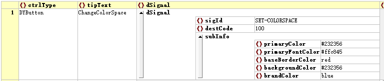

# Color and Color Spaces

To facilitate program development and to meet the diverse needs of products, DYQML introduces the concept of color spaces. In theory, controls in the configuration file do not need to specify colors explicitly. Through color spaces, a set of control color schemes can be designed. At the same time, we can also modify the system's color space when the program loads the configuration file, allowing different configuration files to have different color schemes. We can even switch color schemes during program execution by sending a specified signal.

It is recommended to use RGB hexadecimal representation for colors, such as: `#177ddc`, as well as ARGB hexadecimal representation that includes transparency information, such as: `#80177ddc`. `#333333` can be written as `#333`, and Qt-supported color names can also be used to directly specify colors, such as `red`, `darkgreen`, `lightblue`, etc.

## I. Definition of Color Space in DYQML

In DYQML, the color space is defined in the `qml/controls/DYColorSpace.qml` file, where a set of color schemes is established. The specific definition is shown below:

```qml
// DYColorSpace.qml
QtObject{
    property string brandColor: "#177ddc"
    property string darkerTransBrandColor: "#a0177ddc"
    property string semiTransBrandColor: "#80177ddc"
    property string lighterTransBrandColor: "#50177ddc"
    property string primaryColor: "#333"
    property string secondaryColor: "#555"
    property string lightColor: "#777"
    property string lighterColor: "#999"
    property string successColor: "#67c23a"
    property string warningColor: "#e6a23c"
    property string dangerColor: "#f56c6c"
    property string semiTransSuccessColor: "#8067c23a"
    property string semiTransWarningColor: "#80e6a23c"
    property string semiTransDangerColor: "#80f56c6c"
    property string primaryFontColor: "#fff"
    property string regularFontColor: "#dcdcdc"
    property string secondaryFontColor: "#ccc"
    property string placeholderFontColor: "#aaa"
    property string baseBorderColor: "#ccc"
    property string lightBorderColor: "#bbb"
    property string lighterBorderColor: "#aaa"
    property string extraBorderColor: "#999"
    property string backgroundColor: "#333"
    property string lightBackgroundColor: "#444"
    property string lighterBackgroundColor: "#555"
    property string primaryDisableColor: "#777"
    property string secondaryDisableColor: "#999"
    property string fullTransparentColor: "#00000000"
    property string halfTransparentColor: "#50000000"
}
```

`DYColorSpace` is instantiated as an object in `Main.qml` and is published as a property for easy access by other controls:

```qml
// Main.qml partial code
...
import "./qml/controls"

Window {
    id: frontEnd
    ...
    property var colorSpace
    ...
    DYColorSpace{
    	id: dyColor
    }
    ...
    Component.onCompleted: {
        colorSpace = JSON.parse(JSON.stringify(dyColor));
    }
}
```

In actual use, the color values in the color space are mainly used in the process of assigning parameters of controls, that is, they are used in `parseParameters.js`. When a control has a color property that needs to be assigned but no corresponding color value is specified in the configuration file, the program will look for the corresponding color value in the color space to assign. Taking `DYDataShower` as an example:

```js
case "DYDataShower":
    paras2 = {
        "width": typeof(ctrlJson.width) === "number" ? ctrlJson.width : 200,
        "height": typeof(ctrlJson.height) === "number" ? ctrlJson.height : 30,
        "name": ctrlJson.name ? ctrlJson.name : "NoName",
        "fontColor": ctrlJson.fontColor ? ctrlJson.fontColor : colorSpace.primaryFontColor, //judge which color to use
        "fontSize": ctrlJson.fontSize ? ctrlJson.fontSize : 12,
        "hashKeys": ctrlJson.hashKeys ? ctrlJson.hashKeys : "",
        "unit": ctrlJson.unit ? ctrlJson.unit : "",
        "decimalNum": ctrlJson.decimalNum ? ctrlJson.decimalNum : 2,
    }
    break;
```

The above is the property assignment for the `DYDataShower` control, where the `fontColor` uses a ternary expression to determine whether the `fontColor` field is defined in the configuration file. If it is defined, the color from the configuration file is used; if not, the `primaryFontColor` in the color space is used.

Of course, we can also directly specify that the color attribute value of a control comes only from the color space. For example, for the `DYLoader` control, both its background and border colors are specified as `fullTransparentColor` from the color space. This means that regardless of how the configuration file specifies them, the background and border colors of `DYLoader` are fully transparent:

```js
case "DYLoader":
    paras2 = {
        "width": typeof(ctrlJson.width) === "number" ? ctrlJson.width : 200,
        "height": typeof(ctrlJson.height) === "number" ? ctrlJson.height : 30,
        "ctrlList": ctrlJson.ctrlList ? ctrlJson.ctrlList : [],
        "border.color": colorSpace.fullTransparentColor, // Color of border is full transparent
        "border.width": 0,
        "color": colorSpace.fullTransparentColor, // Color of background is full transparent
        "defaultLoadIndex": ctrlJson.defaultLoadIndex!==undefined ? ctrlJson.defaultLoadIndex : -1,
        "clearSourceByList": ctrlJson.clearSourceByList ? ctrlJson.clearSourceByList : [],
        "setSourceByList": ctrlJson.setSourceByList ? ctrlJson.setSourceByList : [],
    };
    break;
```

## II. Modifying the Color Space through the Configuration File

The color space mentioned above is hardcoded into the program. We can modify them through the configuration file. There are two ways to modify the color space using the configuration file: the first is to modify it when the program loads the configuration file; the second is to modify it after the program has already loaded the configuration file, during the program's runtime, by the user issuing a user event. The following sections will introduce each of them.

### 2.1 Modifying the Color Space When Loading the Configuration File

In the configuration file that needs to be loaded, add a `colorSpace` JSON object within `appSetting` and customize the color values within the `colorSpace` object. You can modify only the colors that are needed, so that when the program loads, it will modify the system's color space, thereby changing the interface's color scheme.


### 2.2 Modifying the Color Space During Program Runtime

In the article of [Signal system composition](https://github.com/kongkongthu/DYQML6/blob/master/docs/3-Signal%20system%20composition.md), it was introduced that there are two preset signals in the system, one of which has a `sigId` of "SET-COLORSPACE". When the system receives a signal containing this `sigId`, it will respond and change the system's color space. The usage is straightforward. For example, in a `DYButton`, we can configure it so that when the user clicks this button, it emits this signal.



## III. Summary

This article introduces the color space in DYQML and the two ways to modify the color space.

