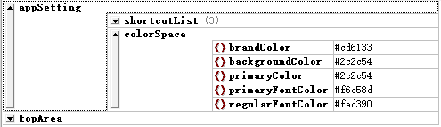
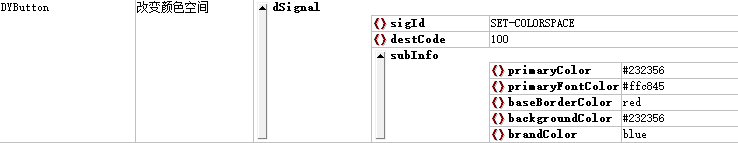

# 颜色与颜色空间

为了方便程序开发，满足多样化的产品需求，DYQML引入了颜色空间的概念。理论上讲，配置文件中的控件都不需要特意指定颜色，通过颜色空间，可以设计出一套控件配色方案。同时，我们也可以通过配置文件在程序加载该文件的时候修改系统的颜色空间，做到不同配置文件拥有不同的配色方案。我们甚至可以在程序运行中通过发送指定信号来修改颜色空间，实现配色方案的切换。

这里建议使用RGB十六进制表示颜色的方法，如：`#177ddc`，以及ARGB这种包含透明度信息的十六进制表示颜色方法，如：`#80177ddc`。`#333333`可以写成 `#333`，也可以使用Qt支持的颜色名来直接指定颜色，如"`red`"、 "`darkgreen`"、 "`lightblue`"等。

## 一、颜色空间在程序中的定义

DYQML中颜色空间定义在**`qml/controls/DYColorSpace.qml`**文件中，在该文件内制定了一套配色方案。具体定义如下所示：

```qml
// DYColorSpace.qml
QtObject{
    property string brandColor: "#177ddc"
    property string darkerTransBrandColor: "#a0177ddc"
    property string semiTransBrandColor: "#80177ddc"
    property string lighterTransBrandColor: "#50177ddc"
    property string primaryColor: "#333"
    property string secondaryColor: "#555"
    property string lightColor: "#777"
    property string lighterColor: "#999"
    property string successColor: "#67c23a"
    property string warningColor: "#e6a23c"
    property string dangerColor: "#f56c6c"
    property string semiTransSuccessColor: "#8067c23a"
    property string semiTransWarningColor: "#80e6a23c"
    property string semiTransDangerColor: "#80f56c6c"
    property string primaryFontColor: "#fff"
    property string regularFontColor: "#dcdcdc"
    property string secondaryFontColor: "#ccc"
    property string placeholderFontColor: "#aaa"
    property string baseBorderColor: "#ccc"
    property string lightBorderColor: "#bbb"
    property string lighterBorderColor: "#aaa"
    property string extraBorderColor: "#999"
    property string backgroundColor: "#333"
    property string lightBackgroundColor: "#444"
    property string lighterBackgroundColor: "#555"
    property string primaryDisableColor: "#777"
    property string secondaryDisableColor: "#999"
    property string fullTransparentColor: "#00000000"
    property string halfTransparentColor: "#50000000"
}
```

`DYColorSpace`以对象的形式实例化到了`Main.qml`中，并以属性的方式公布出来，方便其他控件调用：

```qml
// Main.qml部分代码
...
import "./qml/controls"

Window {
    id: frontEnd
    ...
    color: dyColor.backgroundColor
    ...
    DYColorSpace{
    	id: dyColor
    }
    ...
}
```

在实际使用中，颜色空间中的颜色值主要在控件参数赋值的环节被使用，也就是在**parseParameters.js**中被使用。当某个控件具备某个需要被赋值的颜色属性，但是在配置文件中并没有指定对应的颜色值时，程序就会到颜色空间中去找对应设定的颜色值进行赋值，以`DYDataShower`为例：

```js
case "DYDataShower":
    paras2 = {
        "width": typeof(ctrlJson.width) === "number" ? ctrlJson.width : 200,
        "height": typeof(ctrlJson.height) === "number" ? ctrlJson.height : 30,
        "name": ctrlJson.name ? ctrlJson.name : "NoName",
        "fontColor": ctrlJson.fontColor ? ctrlJson.fontColor : colorSpace.primaryFontColor,
        "fontSize": ctrlJson.fontSize ? ctrlJson.fontSize : 12,
        "hashKeys": ctrlJson.hashKeys ? ctrlJson.hashKeys : "",
        "unit": ctrlJson.unit ? ctrlJson.unit : "",
        "decimalNum": ctrlJson.decimalNum ? ctrlJson.decimalNum : 2,
    }
    break;
```

上面是`DYDataShower`控件的属性赋值，其中`fontColor`采用三元表达式的方式判断配置文件中是否定义了`fontColor`字段，如果定义了就使用配置文件中的颜色，如果没有则使用颜色空间中的`primaryFontColor`的值。

当然，我冒也可以直接指定某个控件的某个颜色属性值只来自于颜色空间，例如`DYLoader`这个控件，它的背景色以及边框的颜色色都被指定为颜色空间中的完全透明色：

```js
case "DYLoader":
    paras2 = {
        "width": typeof(ctrlJson.width) === "number" ? ctrlJson.width : 200,
        "height": typeof(ctrlJson.height) === "number" ? ctrlJson.height : 30,
        "ctrlList": ctrlJson.ctrlList ? ctrlJson.ctrlList : [],
        "border.color": colorSpace.fullTransparentColor, // 边框色完全透明，不可改变
        "border.width": 0,
        "color": colorSpace.fullTransparentColor, // 背景色完全透明，不可改变
        "defaultLoadIndex": ctrlJson.defaultLoadIndex!==undefined ? ctrlJson.defaultLoadIndex : -1,
        "clearSourceByList": ctrlJson.clearSourceByList ? ctrlJson.clearSourceByList : [],
        "setSourceByList": ctrlJson.setSourceByList ? ctrlJson.setSourceByList : [],
    };
    break;
```

## 二、通过配置文件修改颜色空间

上面的所说的颜色空间，是写死在程序中的，我们可以通过配置文件来修改它们。通过配置文件来修改颜色空间有两种方式：第一种是在程序加载配置文件的时候修改；第二种是在程序已经加载完配置文件，在程序运行过程中，由用户发出用户事件来修改。接下来分别进行介绍。

### 2.1 加载配置文件时修改颜色空间

在需要加载的配置文件中，在`appSetting`内添加`colorSpace`的`json`对象，并在`colorSapce`对象内定制`colorSpace`的颜色值。这里可以只修改需要的颜色值，这样程序在加载的时候就会修改系统的颜色空间，从而改变界面的颜色方案。



### 2.2 程序运行过程中修改颜色空间

在**[信号系统构成](https://github.com/kongkongthu/DYQML6/blob/master/docs/3-信号系统构成.md)**中介绍过系统预设的两个信号的，其中一个`sigId`为"`SET-COLORSPACE`"。系统接收到包含该sigId的信号，就会响应并改变系统的颜色空间。使用方法很简单，例如在一个`DYButton`中，我们可以通过配置，让用户点击这个按钮时发出这个信号：



## 三、总结

本文介绍了DYQML的颜色空间，以及修改颜色空间的两种方式。