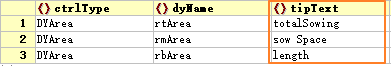

# Shortcuts and tip message configuration

Since the configuration of shortcut keys and tip messages is relatively simple, they are introduced together in this article.

## I. Configuration of Shortcut Keys

First, let's discuss the mechanism by which DYQML implements shortcut keys: shortcut keys are actually a type of user event, just like other user events such as when a mouse clicks a button or selects an option from a dropdown menu. The purpose of these user events is to elicit a response from the interface or the C++ backend program. Therefore, DYQML realizes all these user events by issuing a `dSignal` and the corresponding response. Consequently, the signals emitted by shortcut events are also generated by the events and correspond to the three signals emitted by the DYQML specification using the **signal dispenser**. For more details, please refer to sections 2.1 and 2.2 of [Signal System Composition](https://github.com/kongkongthu/DYQML6/blob/master/docs/3-Signal%20system%20composition.md). Once you understand the composition of the DYQML signaling system, this concept becomes quite clear. The code of `DYShortcut` is shown below:

```qml
import QtQuick 2.15
import "./../js/procEmitSignal.js" as EmitSignal //import signal dispenser

Shortcut {
    property var signalList: []
    context: Qt.ApplicationShortcut
    onActivated: {
        for(let i=0; i<signalList.length; i++){
            try{
                EmitSignal.emitSignal(signalList[i]); // Emit signal by dispenser
            }catch(err){
                console.log(`EmitSignal err in DYShortcut.qml`);
            }
        }
    }
}
```

In simple terms, specify different shortcut keys emitting corresponding `dSignal` in configuration files. After that, the rest is handled by the DYQML signaling system. The user only needs to respond to the event in the control or background program by responding to the signal.

For specific configuration methods, you can refer to section 1.2.2 of [1-Easy to get started with configuration files](https://github.com/kongkongthu/DYQML6/blob/master/docs/1-Easy%20to%20get%20started%20with%20configuration%20files.md). We will not repeat the details here.

## II. Configuration of Tip Messages

Tip messages refer to the informational tips that appear when a user hovers their mouse over a control. With DYQML, it is very convenient to add these tips to the interface through the configuration file.


For DYQML, since all controls are inherited from `DObject` and `tipText` is a property of `DObject`, all controls have the ability to generate tip messages. The system implements the tip information by instantiating `DYToolTip`, and DYQML optimizes the tip information accordingly: 1. Only controls configured with the `tipText` property may generate a `DYToolTip` object, otherwise the `DYToolTip` exists in the state of Component; 2. Only when triggered by a user event, the corresponding `DYToolTip` object will be generated and dynamically destroyed when the user event ends. This ensures that at a certain moment, there is only one `DYToolTip` object in the whole system, which is very necessary to optimize system performance in some special cases.

The configuration is very simple, just configure the `tipText` property and value in any control where you want to add a tip message:



There are only two things to be aware of when using tip messages: 1. Control overrides, where the upper control overrides the lower control, then the tip message of the lower control will not be displayed; 2. Controls with mouse user events may conflict with the mouse event of the tip message.

