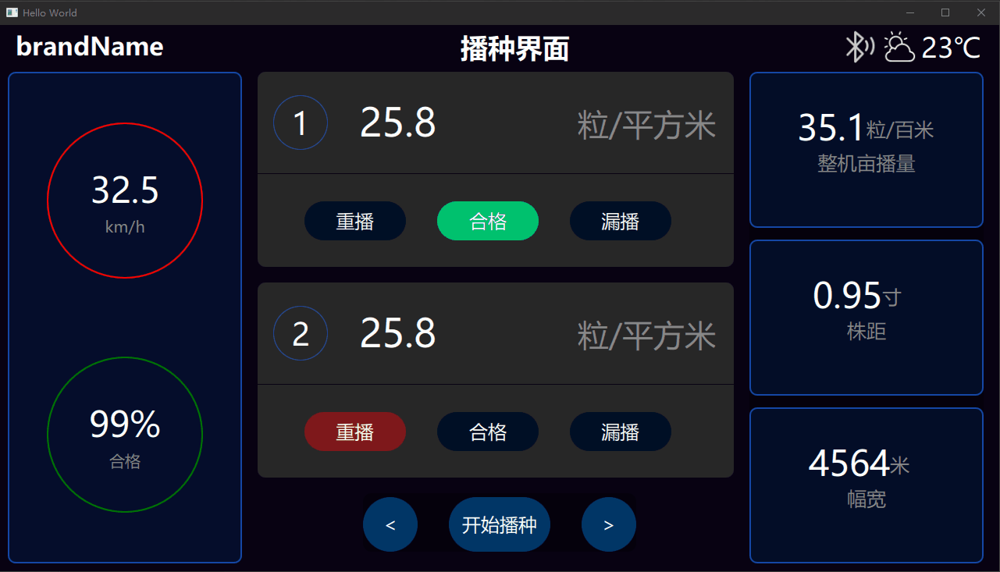
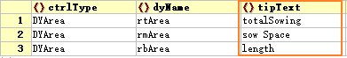
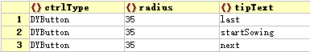

# 快捷键与提示信息的配置

由于快捷键和提示信息的配置比较简单，在这里把它们放在一篇文章里介绍。

## 一、快捷键的配置

**注：快捷键的配置方式已改进，下面的说明已过时，很快会更新文档内容。**

这里先介绍一下DYQML实现快捷键的机制：快捷键实际上是用户事件的一种，它与其他用户事件，例如鼠标点击一个按钮，点选下拉菜单的某一个选项，一样都是用户事件。这些用户事件的目的也一样是要引起界面或后台程序的响应，因此DYQML将所有这些用户事件都通过发出`dSignal`信号体以及对应的响应来实现。因此，快捷键事件发出的信号也是通过事件产生信号并使用**信号分发器**对应的发出DYQML规范的三种信号，具体内容详见[信号系统构成](https://github.com/kongkongthu/DYQML6/blob/master/docs/3-信号系统构成.md)的2.1与2.2节内容。理解了DYQML的信号系统构成，这里就很好理解了。

简单来说就是通过配置，指定不同的快捷键对应需要发出的`dSignal`信号体，然后其他的事情就都交给DYQML的信号系统来完成就好了，用户只需要在需要响应该事件的控件或后台程序中响应该信号。

具体的配置方式可以参考[配置文件简单上手](https://github.com/kongkongthu/DYQML6/blob/master/docs/1-配置文件简单上手.md)的1.2.2节内容。这里不再赘述。

## 二、提示信息的配置

提示信息是指用户在将鼠标放到某个控件上会弹出来的提示信息。通过DYQML可以非常方便的通过配置文件给界面添加提示信息。

对于DYQML来说，由于所有控件都是从`DObject`继承来的，而`tipText`是`DObject`的一个属性，因此所有控件都有能力生成提示信息。系统是通过实例化`DYToolTip`实现提示信息的，并且DYQML对提示信息进行了相应的优化：1、只有配置了`tipText`属性的控件才可能会生成`DYToolTip`对象，否则`DYToolTip`是以Component的状态存在；2、只有在用户事件触发的时候，才会动态生成对应的`DYToolTip`对象，并且当用户事件结束时，会动态销毁。这保证了在某个时刻，整个系统中只有一个`DYToolTip`对象，某些特殊情况下，这对优化系统性能非常必要。

具体的配置方法非常简单，在任何你想要添加提示信息的控件内配置`tipText`属性和值即可：

使用提示信息只有两点需要注意：1.控件覆盖的情况，上层的控件覆盖了下层的控件，那么下层控件的提示信息将不会显示；2.具有鼠标用户事件的控件可能会与提示信息的鼠标事件冲突。

