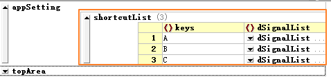
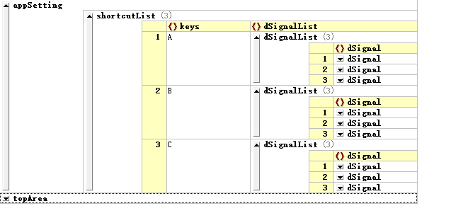
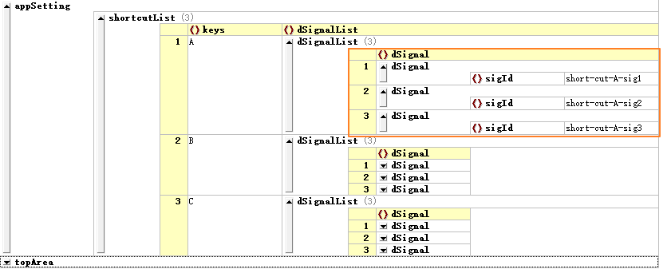

# 快捷键与提示信息的配置

由于快捷键和提示信息的配置比较简单，在这里把它们放在一篇文章里介绍。

## 一、快捷键的配置

### 1. 快捷键实现方式

这里先介绍一下DYQML实现快捷键的机制：快捷键实际上是用户事件的一种，它与其他用户事件，例如鼠标点击一个按钮，点选下拉菜单的某一个选项，一样都是用户事件。这些用户事件的目的也一样是要引起界面或后台程序的响应，因此DYQML将所有这些用户事件都通过发出`dSignal`信号体以及对应的响应来实现。因此，快捷键事件发出的信号也是通过事件产生信号并使用**信号分发器**对应的发出DYQML规范的三种信号，具体内容详见[信号系统构成](https://github.com/kongkongthu/DYQML6/blob/master/docs/3-信号系统构成.md)的2.1与2.2节内容。理解了DYQML的信号系统构成，这里就很好理解了。

简单来说就是通过配置，指定不同的快捷键对应需要发出的`dSignal`信号体，然后其他的事情就都交给DYQML的信号系统来完成就好了，用户只需要在需要响应该事件的控件或后台程序中响应该信号。

### 2. 快捷键配置方式

快捷键配置在顶级入口appSetting内，以Ctrl-Demo-Button-CH.json文件为例：



shortcutList是一个JSON数组，或者说有序列表，内部可以由一个或多个快捷键配置对象组成。在上面的例子中，shortcutList列表中包含三个对象，分别对应键盘A、B、C三个按键，按下这些快捷键，DYQML会利用信号系统对应发出一系列信号，这些信号被定义在dSignalList内。也就是说，一个快捷键可以发出多个信号，而不是只能发出一个信号。例如上面三个快捷键对应的dSignalList列表的长度都是3，因此他们每个快捷键都可以发出3个信号。这样做是为了提高系统的灵活性，以适应各种复杂的业务需求，不过并不建议为一个快捷键配置过多要发送的信号，根据业务需求进行配置就好。点击展开dSignalList，可以看到具体的信号配置信息（这里做了升级，将dSignal作为字段独立出来，从而可以对dSignal作为整体进行操作，方便在配置文件内在各个以及各种控件之间拷贝、移动dSignal）：



系统中发送的信号的信号体被定义为dSignal，dSignal是本项目定义的一种用于信号传递的数据结构，每个dSignal都至少要包括sigId信息，它是信号的标识，缺少则信号不会被发送。这里我们不需要了解太多关于dSignal的设置，只需要知道如果用到了dSignal，则需要配置它的信号标识sigId，而信号发送目的地编码destCode以及子信息subInfo并不是必须的。对系统的信号与信号系统的更详细信息，可以查看文章**[信号系统构成](https://github.com/kongkongthu/DYQML6/blob/master/docs/3-信号系统构成.md)**。下面是展开的dSignal具体内容：



程序加载上面的配置信息，窗体尺寸为1280*700。快捷键有三个，分别为A、B、C三个按键，点击A则会向QML界面发出三个信号，这三个信号的id分别为short-cut-A-sig1、short-cut-A-sig2、short-cut-A-sig3。点击B和C也会相应发出三个不同的信号。

作为对照，上面的配置信息的json源码为：

```json
"appSetting": {
    "shortcutList": [
        {
            "keys": "A",
            "dSignalList": [
                {
                    "dSignal": {
                        "sigId": "short-cut-A-sig1"
                    }
                }, {
                    "dSignal": {
                        "sigId": "short-cut-A-sig2"
                    }
                }, {
                    "dSignal": {
                        "sigId": "short-cut-A-sig3"
                    }
                }
            ]
        }, {
            "keys": "B",
            "dSignalList": [
                {
                    "dSignal": {
                        "sigId": "short-cut-A-sig1"
                    }
                }, {
                    "dSignal": {
                        "sigId": "short-cut-A-sig2"
                    }
                }, {
                    "dSignal": {
                        "sigId": "short-cut-A-sig3"
                    }
                }
            ]
        }, {
            "keys": "C",
            "dSignalList": [
                {
                    "dSignal": {
                        "sigId": "short-cut-A-sig1"
                    }
                }, {
                    "dSignal": {
                        "sigId": "short-cut-A-sig2"
                    }
                }, {
                    "dSignal": {
                        "sigId": "short-cut-A-sig3"
                    }
                }
            ]
        }
    ]
}
```

## 二、提示信息的配置

提示信息是指用户在将鼠标放到某个控件上会弹出来的提示信息。通过DYQML可以非常方便的通过配置文件给界面添加提示信息。


对于DYQML来说，由于所有控件都是从`DObject`继承来的，而`tipText`是`DObject`的一个属性，因此所有控件都有能力生成提示信息。系统是通过实例化`DYToolTip`实现提示信息的，并且DYQML对提示信息进行了相应的优化：1、只有配置了`tipText`属性的控件才可能会生成`DYToolTip`对象，否则`DYToolTip`是以Component的状态存在；2、只有在用户事件触发的时候，才会动态生成对应的`DYToolTip`对象，并且当用户事件结束时，会动态销毁。这保证了在某个时刻，整个系统中只有一个`DYToolTip`对象，某些特殊情况下，这对优化系统性能非常必要。

具体的配置方法非常简单，在任何你想要添加提示信息的控件内配置`tipText`属性和值即可：


使用提示信息只有两点需要注意：1.控件覆盖的情况，上层的控件覆盖了下层的控件，那么下层控件的提示信息将不会显示；2.具有鼠标用户事件的控件可能会与提示信息的鼠标事件冲突。

